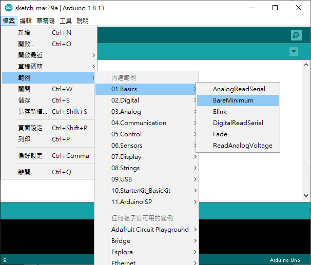
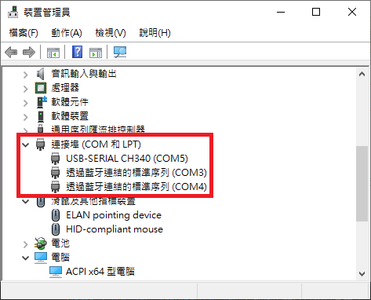

# Arduino 簡介
## 特色
+ OPEN SOURCE
  + 不僅程式碼開源，硬體也是開放的。可以免費下載開發用IDE、電路設計圖。
+ 簡單好用資源多
  + 網路上很多作品可供參考使用。
+ 物美價廉
  + 就便宜阿
  
 

# 開發環境

## Sketch
官方提供的免費IDE，程式語法類似於C/C++，跨平台。

 

每支Arduino程式都會用到Setup()、loop() 兩個函式，為求方便可以直接抓範例 BarMinimun。

 

# 環境測試
可以利用範例中的Blink進行測試

「上傳」按鈕可以先將程式碼驗證再寫入板子。
(我買的便宜大陸版偶爾會出錯，多試幾次總會成功一次...)

如果出現下圖情況，可以先去裝置管理員找設定接口，如沒有可能是驅動未安裝。

官方IDE內已經含有驅動程式，可以指定位置安裝。

如果是非官方版本Arduino，可能會出現USB2.0-Ser!

這時候只需要去GOOGLE找CH340晶片驅動安裝程式即可。

# 參考引用網站

傑森創工
 https://blog.jmaker.com.tw/