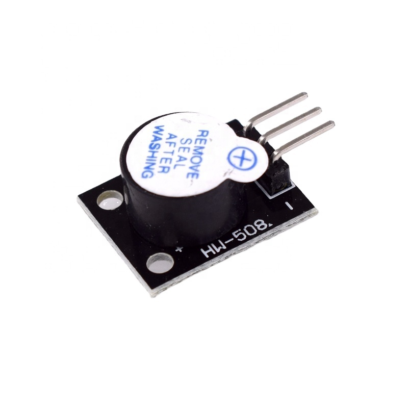
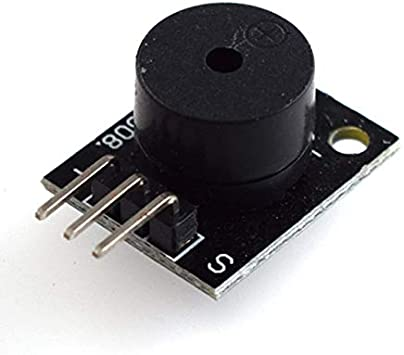

# Buzzer 蜂鳴器
### 蜂鳴器主要分為有源蜂鳴器、無源蜂鳴器。
<br/>


# 有源蜂鳴器


有源蜂鳴器(HW-512)
+ 內建一組固定頻率
+ 接上電源就會發出固定的音調。
+ 外觀上通常正面會貼白色貼紙，底部會有膠。
  


有源蜂鳴器的使用很簡單，給予高電壓就會出聲。<br/>

範例接腳：
+ (+)=[Pin 7]
+ (-)nal(G)=[Pin GND]\
```ino
//設定腳位
const int PIN = 7;
void setup() {
  //設定腳位模式
  pinMode(PIN,OUTPUT);

}

void loop() {
  //給予高電位，使有源蜂鳴器出聲
  digitalWrite(PIN,HIGH);
  delay (1000); 
  digitalWrite (PIN, LOW); 
  delay (2000); 

}
```
# 無源蜂鳴器

無源蜂鳴器(HW-508)
+ 必須透過程式給予頻率。
+ 外觀上底部可以直接看到電路板。


無源蜂鳴器需要處理聲音的頻率。較為麻煩，但Arduino的IDE有提供基本範例「toneMelody」可以使用。
> 範例 > 02.Digital > toneMelody

```ino

//載入音調、頻率的對照檔。
#include "pitches.h"

//旋律
int melody[] = {
  NOTE_C4, NOTE_G3, NOTE_G3, NOTE_A3, NOTE_G3, 0, NOTE_B3, NOTE_C4
};

// 每個音的拍子。4:4分音符、8:8分音符。
int noteDurations[] = {
  4, 8, 8, 4, 4, 4, 4, 4
};


void setup() {
  // iterate over the notes of the melody:
  for (int thisNote = 0; thisNote < 8; thisNote++) {

    //計算音符長度。4分音符：1000/4
    //            8分音符：1000/8
    int noteDuration = 1000 / noteDurations[thisNote];

    //tone(Pin,音調,拍子)，這是主要撥放的函式。
    tone(7, melody[thisNote], noteDuration);

    //每個音之間要停一小段，範例上建議為拍子長度+30%
    int pauseBetweenNotes = noteDuration * 1.30;
    delay(pauseBetweenNotes);

    //停止撥放
    noTone(7);
  }
}

void loop() {
  //不需要重複撥放，所以這裡不寫。
}
```