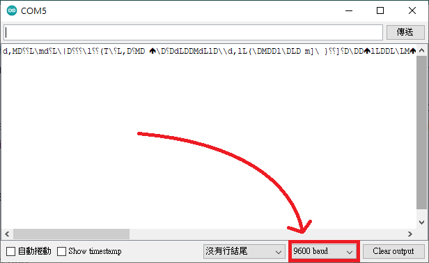

# Analog Read Serial 類比訊號讀取

官方文件：

This example shows you how to read analog input from the physical world using a potentiometer. A potentiometer is a simple mechanical device that provides a varying amount of resistance when its shaft is turned. By passing voltage through a potentiometer and into an analog input on your board, it is possible to measure the amount of resistance produced by a potentiometer (or pot for short) as an analog value. In this example you will monitor the state of your potentiometer after establishing serial communication between your Arduino and your computer running the Arduino Software (IDE).


單字解釋
+ resistance 阻力、電阻
+ amount of resistance 可變電阻
+ serial communication 序列通訊
+ potentiometer 電位器(可變電阻。簡稱 POT)
+ establishing 建立

本人的不負責翻譯： 

此範例將展示如何從可變電阻讀取類比訊號，可變電阻是一個轉動轉軸可以改變電阻值的簡單機械元件。當電流經過可變電阻時會有類比訊號輸入到Arduino板子上，將可以測量可變電阻產生的電阻值。在此範例內將可以透過IDE監測建立在電腦與Arduino之間的序列傳輸狀態。


硬體需求：
+ Arduino Board 
+ 10k ohm Potentiometer


# CODE

## 建立序列通訊

```ino
Serial.begin(9600);
```

當你想要從Arduino輸出某些資料到電腦的時候，通常需要輸出資料都會用到，比如接收JoyStick的位置。通常這個函式會放在setup()裡面，他只需要執行一次即可。

9600代表的是baud rate(鮑率)，指符號的傳輸速率，1鮑表示每秒傳輸一個符號。可以透過不同的調變方法讓一個符號附載多個位元。典型的鮑率為300, 1200, 2400, 9600, 19200, 38400, 115200等。


## 設定類比訊號接收腳位
```ino
int sensorValue = analogRead(A0);
```

## 輸出資料
```ino
Serial.println(sensorValue);
```
可以在監控視窗查看數值，監視視窗的鮑率必須跟起初設定的一樣。



print()跟println()的差異在於LN會先做換行的動作，如果全部都用print則會黏在一起。

## 延遲
```ino
delay(1)
```
每次讀取中間做個延遲，單位是毫秒。


## 參考資料
### Youtube 
[What is Serial.begin(9600)?](https://www.youtube.com/watch?v=8GX5brSZ_1E)

### Arduino.cc官網

[AnalogReadSerial](https://www.arduino.cc/en/Tutorial/BuiltInExamples/AnalogReadSerial)