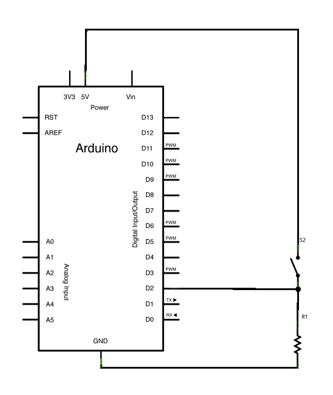
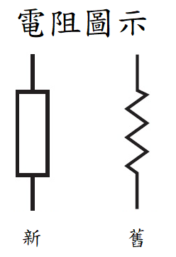

# DigitalReadSerial 讀取數位訊號

## 範例接版：


## 圖解：



## 這是電阻的圖案



## 說明

當按鈕為未按下時(開路狀態)，d2接收到低電位(0)，當按下(閉路)時，則接到高電位(1)。


## 範例CODE

```ino
int pushButton = 2; //設定按鈕的腳位。

void setup() {
  //建立序列通訊。
  Serial.begin(9600); 
  //設定按鈕腳位為輸入，就是接收資料的意思。
  pinMode(pushButton, INPUT);
}

void loop() {
  int buttonState = digitalRead(pushButton);  //宣告變數儲存按鈕狀態
  
  Serial.println(buttonState);  //顯示變數
  delay(1);        // 延遲一秒
}

```