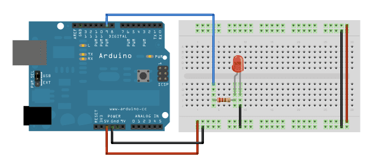
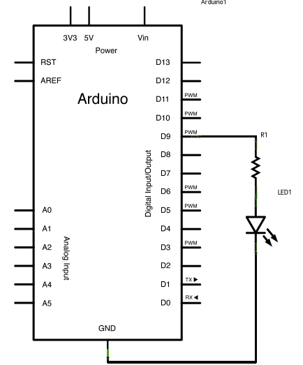

# Fade 用類比訊號輸出做呼吸燈LED
Fade 退色，可表達淡入淡出的意思。

## 官方文件：

This example demonstrates the use of the analogWrite() function in fading an LED off and on. AnalogWrite uses pulse width modulation (PWM), turning a digital pin on and off very quickly with different ratio between on and off, to create a fading effect.

## 單字解釋：
+ demonstrates 展示
  

## 本人的不負責翻譯： 

此範例展示如何使用 analogWrite() 函式 製作出呼吸燈LED，AnalogWrite使用PWM(模擬類比運號)功能讓LED快速的更換頻率達到呼吸燈的效果。

## 範例接版：

## 圖解：

