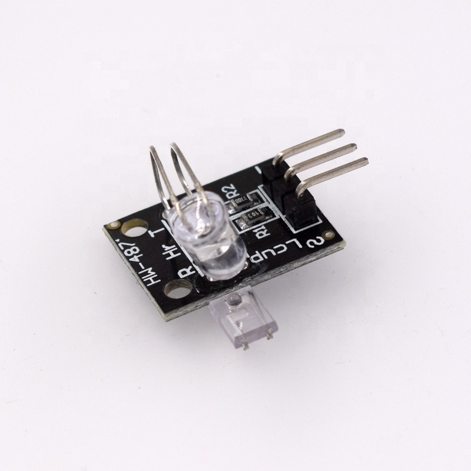

# 手指心跳感測器

(HW-502) 
此模組沒有醫療價值，單純實驗性質。

此模組採用超亮紅外線(IR)LED和光敏晶體管(光敏電阻)以光變化來探測手指脈搏，隨著心臟跳動光敏電阻的電阻值會不斷變化，Sensor容易受環境的光影響，可以用個容器將手指與Sensor遮住，測出來數字會較為合理。正常人心跳在60~100次之間，如依然有問題可以調整Alpha、Beta參數試試。(感測器輸出為類比訊號)