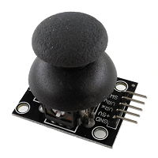
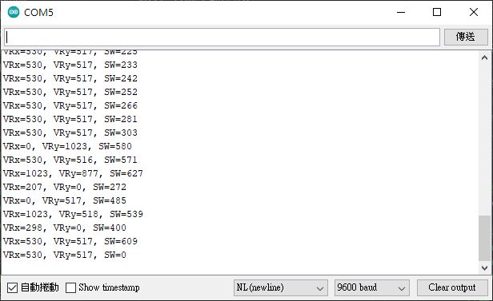

# JoyStick 搖桿 (HW-504)


此模組為專門設計給Arduino使用，所以在使用上非常簡便。只有五支接腳，左右(VRx)、上下(VRy)、按壓(SW)輸出皆為類比訊號，最小值為0、最大值為1023，SW按下則是為0。
<br/>分別將這三個接腳連接至類比訊號(Analog IN)的A1,A2,A3做範例演練，只要直接使用analogRead就可以取得相對應的值。
```ino
    //設個變數
    int vrx,vry,sw;

    //取得數值
    vrx=analogRead(A1);
    vry=analogRead(A2);
    sw=analogRead(A3);

    //顯示數值，方便監控。
    char buf[100];
    sprintf(buf, "VRx=%d, VRy=%d, SW=%d", vrx, vry, sw);
    Serial.println(buf);
    delay(100);
```

測試程式燒錄完成之後，可使用監控視窗查看搖桿返還的值。
