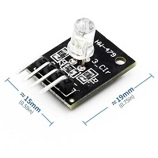
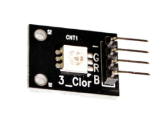
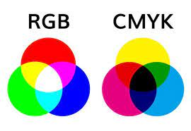

# RGB 三色LED (HW-479)

一般常見的5mm RGB LED模組都為共陰，板上只有一個GND沒有VCC。若為共陽則只有一個VCC。

模組共有4支腳位，每個原色有0~255的變化。組合共有1677萬色，稱為全彩。

因為需要傳遞0~255的數值給RGB這三個腳位，所以必須將腳位接在有PWM的腳位上。UNO版上有畫出(~)的腳位，範例以9、10、11做操作。

範例接腳：
+ signal(R)=[Pin 9]
+ signal(G)=[Pin 10]
+ signal(B)=[Pin 11]
+ GND(-)=[Pin GND]

# SMD LED (HW-478)

### SMT（SMT: surface Mount Technology）
是表面貼裝技術，是指用貼片的方式將元器件貼在PCB上焊接，

### SMD（SMD: surface Mount Device）
而用SMT焊接在PCB上的元器件就是SMD。

