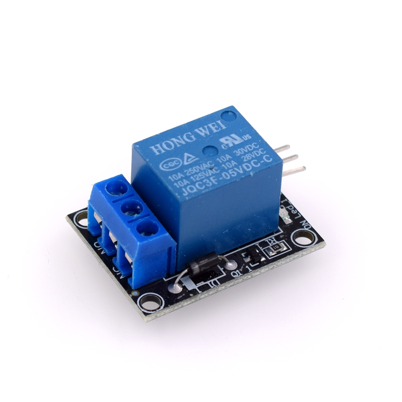

# Relay 繼電器

Arduino搭配繼電器能夠控制110V的家用電源，使用起來就像開關一樣，可以用程式控制通電或是斷電。

(HW-482)

HW-482是常見的一路繼電器，如果使用其他的二路、四路、八路的繼電器，控制方式基本上一樣。

通常繼電器背面會寫上高電平或是低電平，意旨觸發情況。高電平就是給予訊號線HIGH電位時觸發，低電平反之。

繼電器上會印有電壓、電流的容許值，如果要長期使用建議買有明確標示的繼電器。

繼電器上的接腳：
+ 正(+)：5V
+ 負(-)：GND
+ 訊號(S)：Pin 7

對外接腳有三個，分別為：

+ NO ：Normal Open 常開，一般情況不通電。
+ COM： Command Ground 共接電，通常會把外電接到這個腳位。
+ NC ：Normal Close 常閉，通常為接通。

