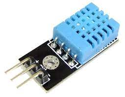

# 溫溼度感知器

市面上的溫溼度感知器有分DHT11,DHT21,DHT22



本範例使用的是DHT11，使用Adafruit DHT Sensor Library函式庫。

感知器的接線非常簡單，只有GND、VCC、Singal，DHT11的電壓可以接受3.3V跟5V。


## CODE
_參照code：TempAndHumidty.ino_


引用函式庫
```ino
#include "DHT.h"
```

設定腳位，#define就是在程式執行前，宣告變數
```ino
//宣告 DHTPIN=9
#define DHTPIN 9
```

根據使用的模組，三選一。
```ino
#define DHTTYPE DHT11     //也是宣告DHTTYPE=DHT11的意思
//#define DHTTYPE DHT22   // DHT 22 如果用的是DHT22，就用這行
//#define DHTTYPE DHT21   // DHT 21
```

宣告主體。
```ino
DHT dht(DHTPIN, DHTTYPE);
```

程式內容
```ino
void setup()
{
  Serial.begin(9600);
  Serial.println("DHTxx test!");
    dht.begin();  //初始化DHT
  
} // setup()

void loop()
{
  delay(1000);
  float h = dht.readHumidity();   //取得濕度
  float t = dht.readTemperature();  //取得溫度C

  //顯示在監控視窗裡
  Serial.print("Humidity: ");
  Serial.print(h);
  Serial.print(" %\t");
  Serial.print("Temperature: ");
  Serial.print(t);
  Serial.println(" *C ");
 
} // loop()
```