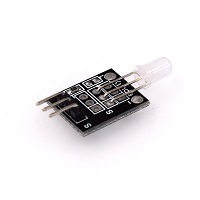
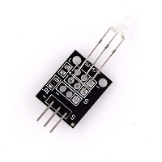

# 雙色LED燈 (HW-480)

 (雙色燈 HW-480)

 (小雙色 HW-477)

 雙色LED基本有四種顯示型態。
1. 熄滅
2. 顏色1亮
3. 顏色2亮
4. 顏色1+2混和
   
顏色為出廠即製做好的，無法更改。
 本人手上的雙色燈(HW-480 & HW-477)為紅+綠色，但物料太爛只會出紅色、黃色，單綠色的部分可能壞掉。

範例接腳：
+ signal(R)=[Pin 9]
+ signal(G)=[Pin 10]
+ GND(-)=[Pin GND]

