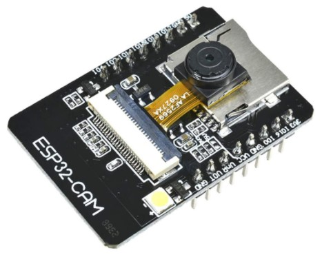
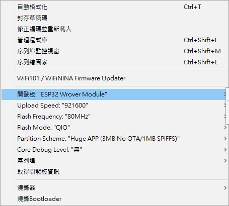

# ESP32 CAM

## ESP32-CAM特點：
+ 支援OV2640、OV7670相機模組
+ TF插槽(也就是MicroSD)
+ 內建閃光燈
+ 建議5V 2A ，否則圖像可能出現波紋

 
 
 

## USB to TTL 使用

ESP32-CAM本身沒有USB接口，需要使用USB to TTL模組。

我購買的是FTDI的模組，在FTDI官網有驅動程式下載。

官網下載位置 ： [ftdichip drivers](https://ftdichip.com/drivers/)

|USB to TTL ||ESP32-CAM |
|:---:|:---:|:---:|
|5V|⇔|5V|
|GND|⇔|GND|
|RXD|⇔|UOT|
|TXD|⇔|UOR|
|||IO0⇔GND(燒錄時自體跳接)|

 
 
 

## IDE 設定
ArduinoIDE的開發版要選擇「ESP32 Wrover Module」。

燒錄時先按一下RST，才不會出錯。

如果燒錄時出現「a fatal error occurred: md5 of file does not match data in flash!」，把上傳速率降低到115200可以解決。

 
 
 

# 常見問題

|錯誤問題||解決方法|
|:---:|---|:---:|
|燒錄時一直卡在連線中，而且出錯。|| 確認IO0與GND跳線，按下RST鍵。|
|a fatal error occurred: md5 of file does not match data in flash!||降低上傳速率，建議115200。|
|燒錄時出現Time Out||確認IO0與GND跳線，按下RST鍵。|
|監控視窗沒有東西，或是沒有正常工作。||ESP32-CAM需要5v才能正常運作，燒錄時可以3v。|
|Brownout||ESP32用電量較大，需要較好的線材或是USB插槽。|