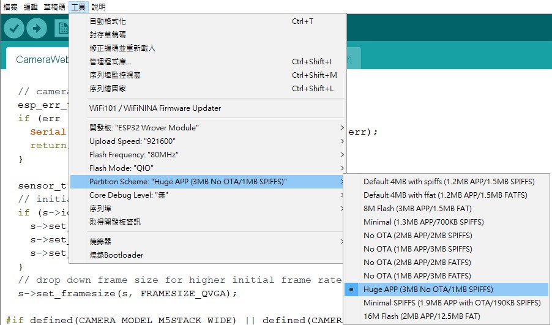

# CameraWebServer 範例程式

此範例使用安信可 ESP32-CAM。

範例程式打開會先看到密密麻麻的註解，主要是最後一句，大意是說圖片如果超過緩衝大小，將只傳輸部分圖片。

```ino
//WARNING!!! PSRAM IC required for UXGA resolution and high JPEG quality
//Ensure ESP32 Wrover Module or other board with PSRAM is selected
//Partial images will be transmitted if image exceeds buffer size
```

<br/>

---

<br/>

## 選擇相機模組

挑出目前模組，其餘的可以刪除或註解掉。

這裡使用CAMERA_MODEL_AI_THINKER。

```ino
// Select camera model
#define CAMERA_MODEL_WROVER_KIT // Has PSRAM
#define CAMERA_MODEL_ESP_EYE // Has PSRAM
#define CAMERA_MODEL_M5STACK_PSRAM // Has PSRAM
#define CAMERA_MODEL_M5STACK_V2_PSRAM // M5Camera version B Has PSRAM
#define CAMERA_MODEL_M5STACK_WIDE // Has PSRAM
#define CAMERA_MODEL_M5STACK_ESP32CAM // No PSRAM
#define CAMERA_MODEL_AI_THINKER // Has PSRAM
#define CAMERA_MODEL_TTGO_T_JOURNAL // No PSRAM
```

<br/>

---

<br/>

## Wifi 連線

設定要連線的基地台名稱與密碼。

```ino
const char* ssid = "*********";
const char* password = "*********";
```

<br/>

---

<br/>

## 使用

燒錄時要注意，一定要把Partition Scheme 改成Huge APP，否則會出現程式碼過大，無法編譯跟上傳。



燒錄完畢記得將Jumper拔除，並且RST。

接下來就會在監控視窗看見一串IP位址。

將位址輸入到瀏覽器即可看見監控畫面，按下按鈕開始取得影像。

使用時可以觀看監控視窗做效能評估，會有FPS可供參考。

## 介面相關設定

|名稱|功能|
|:---:|:---:|
|Face Detection|臉部偵測|
|Get Still|照相(畫面暫停)|
|Start Stream|影像串流|