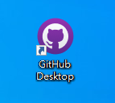
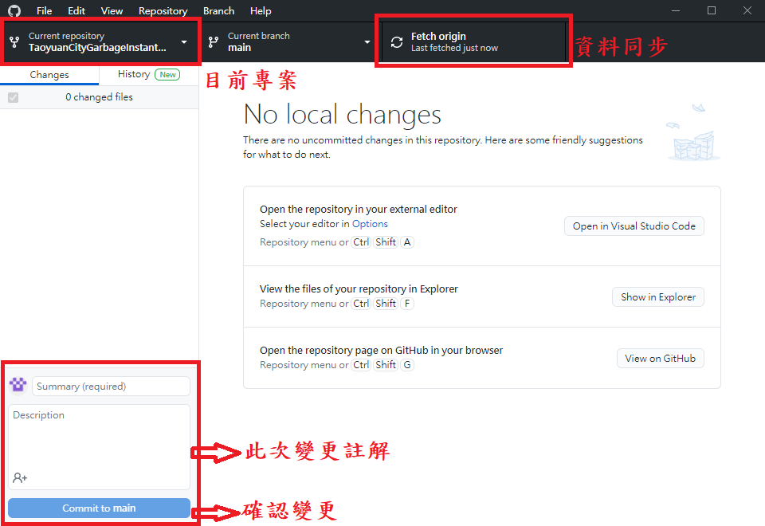
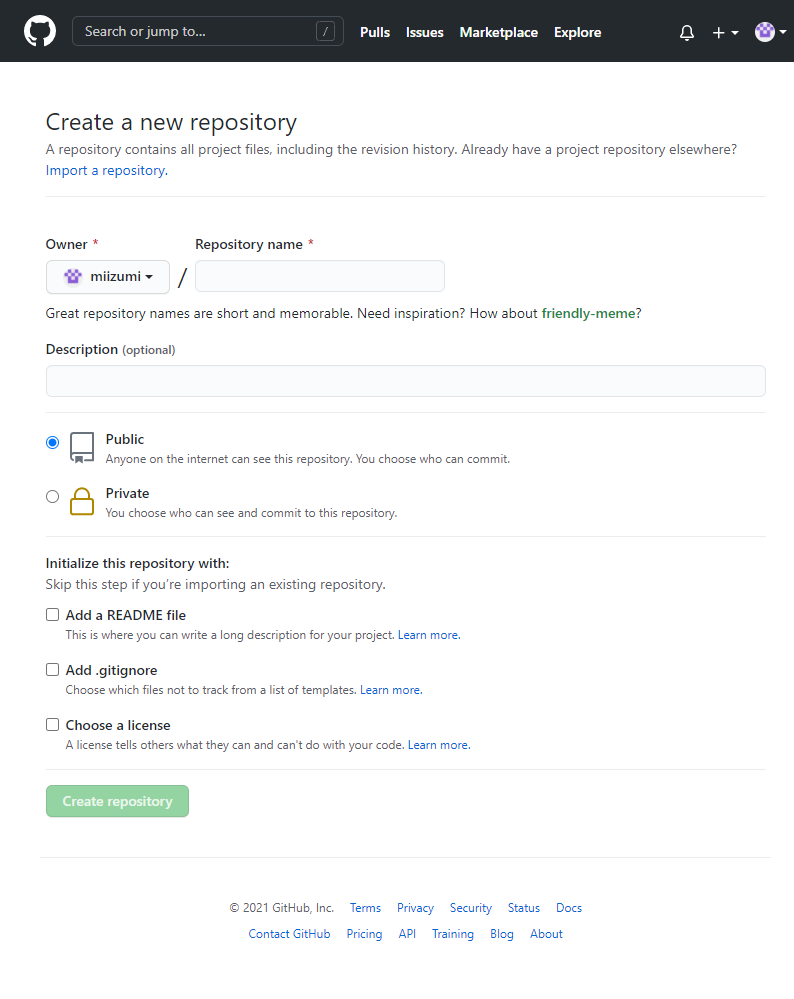

# GitHub

GitHub與Git是有關聯但不同的東西，GitHub則是一個網站提供免費空間(大約1G)可以放上自己的Code。

只能建立三個免費的私人專案，第四個開始必須付費，或是公開專案。

 
(官方網站)

add.gitignore

Choose a license

# GitHub Desktop

GitHub的圖形化介面，方便好用，不用背指令。
 
(應用程式圖示) 

(程式介面) 

 

# 建立一個新的專案

Repositories 代表的是放程式碼的倉庫，意旨代碼庫。

新增一個代碼庫，用來放想做版本控制的專案或檔案。

接著會到建立的畫面。

+ Repository name ：代碼庫名稱 
+ Description ：說明文字
+ Public ：公開
+ Private ：私人專案
+ Add a README file：
&emsp;&emsp;&emsp; ㄅ ㄅ

clone 可以複製自己的也可以複製別人的。

readme文件會顯示在專案的主頁上，不要亂寫。

功能介紹
issues