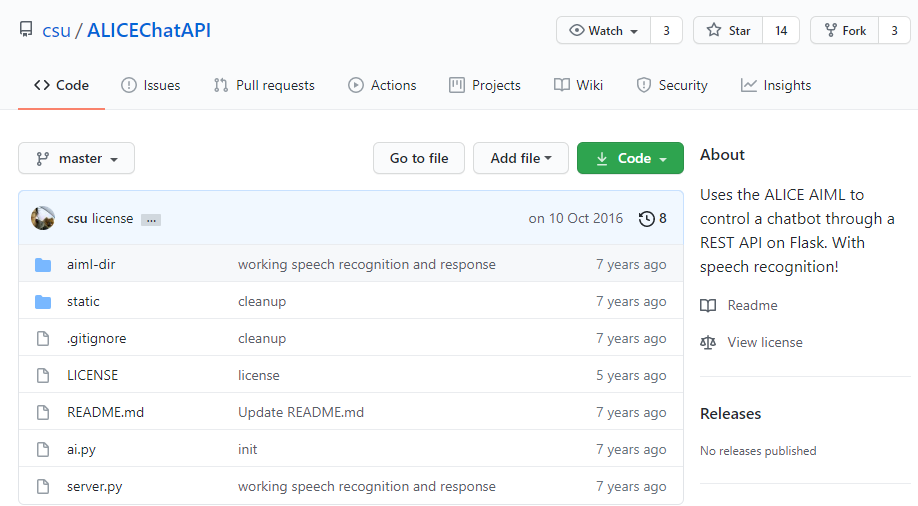

# AIML 人工智慧標記語言
## Artificial Interlligence Markup Language (AIML)

AIML其實就是XML的檔案格式，網路上有很多aiml的範例可以下載。

目前完成度最高的英文專案是「Alice」，到GITHUB搜尋「ALICEChatAPI」。



python需依靠第三方函式庫使用AIML，請安裝0.9.1版本，其他版本對應中文字有問題。
>pip install aiml==0.9.1

```python
import aiml
```

aiml函式庫中的kernal函式有使用到time.clock()這個函式，但在3.8以上的版本此函式已經被移除。

故會報錯：AttributeError module 'time' has no attribute 'clock'


此時要進到aiml的函式庫更改kernal函式中有使用到的部分都更改為time.perf_counter()。

# 建立對話機器人
*參照code：1.AIML.py*<br/>
*參照xml：1.AIML.xml*<br/>

要先準備好對話用的AIML檔。

先宣告一個主體，並給予AIML作為核心依據。
``` python
kernel=aiml.Kernel()
kernel.learn('1.AIML.xml')
```

input接收使用者對話，用死迴圈包起來可以一直重複對話動作。
```python
while True:
    talk=input('說話啊>>') #讓使用者輸入對話。
    response=kernel.respond(talk)   #跟據對話關鍵字取對應字串。

    #有些版本執行，出錯不會跳到except，會得到空字串。
    if response=='':    #當收到空字串時
        response="再說一次阿"

    print(response) #顯示回傳值給使用者。
```

<br/>
