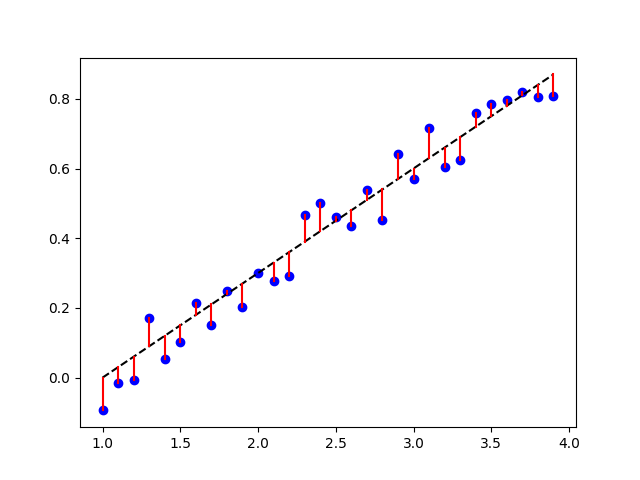

# Residual 殘差

_參照code：2.Regression_residual.py_

正常情況下，資料不可能乖乖地坐落在線上，一定會有誤差值然。

好的迴歸分析就是要想盡辦法讓畫出來的線落在與每一個點的最短路徑中，好的分析結果取決於利用線性回歸計算出趨勢線的位置和斜率，以及實際資料之間的誤差。

簡單來說，實際資料誤差越小，畫出來的分析結果越漂亮，殘差越小，準確率越高。

殘差值就是使用迴歸分析出的線，來計算該線與每一個點之間的距離，然後以絕對值將所有距離相加，在除以數量。在迴歸分析中，要是能將殘差趨近於0，則線性回歸結果越佳。

(圖中的紅線，就是殘差)