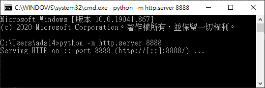
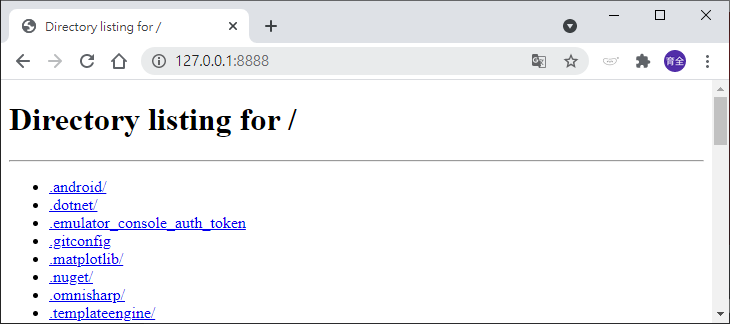

# HTTP 網頁伺服器
## 測試函式庫
進入cmd視窗輸入指令 
(不需要PIP安裝。) 

Python 2.x 需使用SimpleHTTPServer函式庫測試
>python -m SimpleHTTPServer 8888

Python 3.x 則使用http.server測試
>python -m http.server 8888

 (成功畫面)

執行成功以後，在瀏覽器上輸入 http://127.0.0.1:8888/ 
 就可以看見硬碟檔案路徑顯示在瀏覽器上。

---
