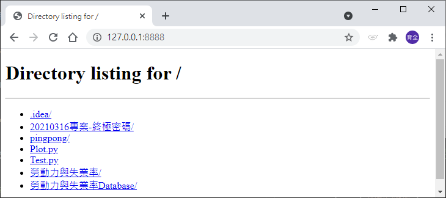

# 基本語法開發

_參照code：2.HTTP_Main.py_

範例使用socketserver函式庫，不需安裝PIP。
<br/>引用需要的函式庫
```python
import sys

#Python 3.0寫法
if (sys.version_info >(3,0)):
    import socketserver
    import http.server
    from http.server import SimpleHTTPRequestHandler as RequestHandler

#Python 2.0寫法
else:
    import SocketServer as socketserver
    import BaseHTTPServer
    from SimpleHTTPServer import SimpleHttpRequestHandler as RequestHandler
```

讓程式可以更改Port的寫法(非必要，但能讓程式靈活使用)。
```python
#檢查是否有被給予參數
if sys.argv[1:]:    #argv的講解請至基本語法的Sys查看
    #有參數即接收參數的數值去指定port
    port=int(sys.argv[1])
else:
    #預設 8888
    port = 8888
```

Port如果被其他程式占用，則可能出現問題。
在程式碼裡也要記得不用要進行關閉的動作。

這段程式碼能改善被占用忘記釋放的問題，建議使用。
```python
#能改善佔據Port而產生的問題
socketserver.TCPServer.allow_reuse_address=True
```

要先宣告主體，(host,port)的部分可以指定連接埠，0.0.0.0 = 本機。
```python
#參數((Host,Port),Handler)
httpd=socketserver.TCPServer(('0.0.0.0',port),RequestHandler)
```

正式上線，停止時必定會出現錯誤，所以用Try包起來，眼不見為淨。
```python
try:
    #這段Code執行會出現無限迴圈，等待網頁的請求。
    #需要離開時按下CTRL+C即可
    httpd.serve_forever()
except:
    print('關閉伺服器')
    #一樣用完要記得關閉
    httpd.server_close()

```

程式執行時可以至瀏覽器測試。(http://127.0.0.1:8888/)

網頁伺服器出現的是程式執行位置路徑底下的檔案。



如果相同網域底下有其他設備，也可以連接本機的IP位址進行遠端連線。

---

