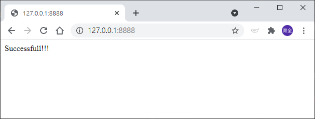

# HTTP的顯示內容

_參照code：3.HTTP_Main.py_

以繼承方式(OOP概念)繼承HTTP原有的反應Class，並修改關鍵性的Method，可以調整網頁上的內容與設定。<br/>
被繼承的類別：_SimpleHTTPRequestHandler_。

這裡修改*do_GET*方法作為範例。

```python
#繼承原先的HTTP反應類別
class MyHandler(RequestHandler):
    #重寫原有的回應方法，此方法會在被網頁要求回應的時候啟動。
    def do_GET(self):
        self.send_response(200)                     #回傳一個正確的回應。
        self.send_header("Content-type","text/html")#設定反應格式為文字。

        self.end_headers()  #HTTP表頭處理完畢
        print(self.wfile)   #這是回傳給網頁要求的相關變數

        output=b""      #這邊宣告新的變數裡面放新的網頁內容，並轉成Byte字串
        output+=b"<html><body>HELLO</body></html>"
        self.wfile.write(output)    #寫入新的網頁內容
```


記得要換上新的反應類別，這很重要，別犯蠢。
```python
httpd=socketserver.TCPServer(('0.0.0.0',port),MyHandler)
```

一樣連線到 http://127.0.0.1:8888/ ，就會看到成功畫面。

