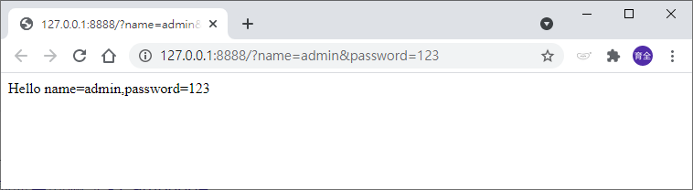

# HTTP GET 取得HTTP傳遞的資料
_參照code：4.HTTP_GET.py_

透過URL取的使用者以瀏覽器傳遞的資料，再傳給伺服器。<br/>
主要方式在於Handler(HTTP反應函式)的其中一個變數「self.path」的屬性，他能取得完整的URL，再透過Urlparse類別解析透過HTTP GET所傳遞來的資料，並且轉換成Dictionary。<br/>
_HTTP GET語句範例：http://127.0.0.1:8888/?name=admin&password=123_

```python

class MyHandler(RequestHandler):
    #處理表頭的方法
    def do_HEAD(self):
        self.send_response(200)
        self.send_header("Content-type","text/html")

        self.end_headers()
    def do_GET(self):
        #取得並解析完整的URL
        query=urlparse(self.path).query

        #上述方法取得的值長這樣。
        #path:   /?name=admin&password=123
        #query： name=admin&password=123


        #老師教學將宣告變數放在這，並先以byte字串表示，但其實不用做，只是方便同學理解。
        #name=b""
        #password=b""

        #當HTTP GET有收到值的時候作動
        if query!="":
            #取得資料，以下會取得URL中「?name=admin&password=123」的這段資料。   #翻譯：components=成分、零件
            query_components=dict(qc.split("=") for qc in query.split("&"))

            #宣告變數放入取得的值
            name=query_components["name"]           #取得name的值
            password=query_components["password"]   #取得password的值

        self.do_HEAD() #在這裡做表頭處理。

        #刻上要回傳的HTML格式與內容。-----------------------
        output=b""
        output+=b"<html><body>Hello name="
        #收到的資料要轉成UTF-8
        output+=name.encode('utf-8')
        output+=b",password="
        output+=password.encode('utf-8')
        output+=b"</body></html>"
        #刻到這裡結束，刻這種東西很累，盡量找其他IDE輔助完成較不會出錯。

        self.wfile.write(output)    #寫入新的網頁內容

```

成功畫面。



### 補充說明
如果需要再GET下中文，收到的關鍵字會出現Byte編碼，要用函式庫轉換。
```python
        #反轉URL格式，為了能下中文。
        query=urllib.parse.unquote(query)
```