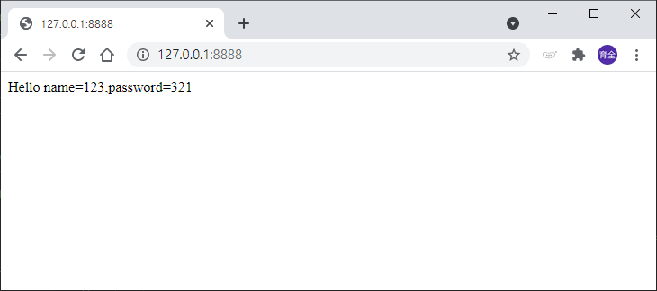

# HTTP POST 取得資料
_參照code：5.HTTP_Post.py_<br/>
_參照html：5.HTTP_Post.html_<br/>

HTTP POST傳遞的方法相對較為安全，主要是使用self.rfile.read(varLen)的方式取得POST的內容，但是該函數需要知道使用者傳遞過來的資料長度。<br/>
還需要使用下面函式取得長度。
```python
varLen=int(self.headers['Content-Length'])
```
再使用Urlparse類別解析POST傳來的資料，並且轉成Dictionary。


為了測試HTTP POST 需要兩個範例檔案(html、py)

<br/>

---


## HTML範例
使用method="post"，將網頁表單裡的內容透過HTTP POST送到"http://127.0.0.1:8888/"此程式的網址。
```html
<form action="http://127.0.0.1:8888/" method="post">
        <!--刻出輸入框的元件，以及送出的按鈕元件-->
	    name:<input type="text" name="name"><br>
	password:<input type="text" name="password"><br/>
	<input type="submit" value="Submit">
</form>
```

完成畫面會有兩個輸入框，及一個送出按鈕。


---


## Python範例
使用方式與HTTP GET相似，只是使用了專門處理HTTP POST的通訊協定。

POST取值需要引用新的函式
```python
from urllib.parse import parse_qs
```

之前的範例都是覆寫了do_GET方法，而這次改成用do_POST。
```python
    def do_POST(self):
        #取得傳遞來的資料長度
        varLen=int(self.headers["Content-Length"])

        #當HTTP POST有收到值的時候作動
        if varLen>0:
            #取得並解析完整的URL
            query_components=parse_qs(self.rfile.read(varLen),keep_blank_values=1)

            print(query_components)
            #取值放入變數
            name=query_components[b"name"][0]
            password=query_components[b"password"][0]
```

程式完成後，開啟HTML送出資料，就可以看到成功畫面了。
