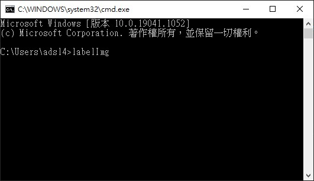

# LabelIMG

官方網站：https://tzutalin.github.io/labelImg/

labelimg是免費的影像標註工具，標註圖片上的物體可以用來做人工智慧的訓練集，支援多平台，Windows、Linux、Mac。

Window、Linux在官方網站有已經編譯好的版本可以直接下載使用。

## 安裝

直接使用PIP install 安裝

> pip install labelImg

安裝完成以後直接指令執行即可

>labelImg

windows cmd指令

