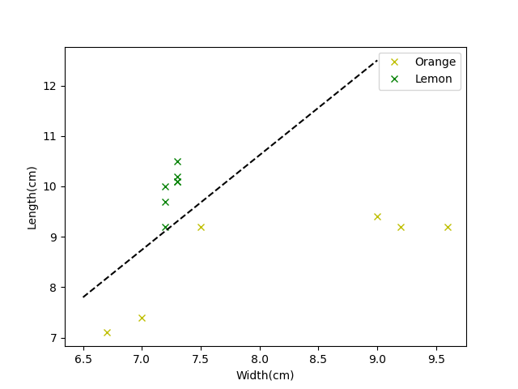

# Machine Learning 機器學習

## 資料準備
資料準備時，一定要注意資料是否為因果關係。

_於學術文件中的定義為，依照自變數與依變數的關係。_

因果關係的變化一定要有彼此的連動關係，機器學習的數據內容必須要有以下兩種欄位。

### &emsp; Features(特徵): 因，統計學稱「自變數」。

### &emsp; Label(標籤答案)：果，統計學稱「依變數」。

 
 

機器學習需要大量的因果關係的資料，資料量至少一百筆以上，大量的數據就稱之為資料集(DataSet)。若能達到數百數千萬筆資料，結果會更佳精準。

重點就是，你給它甚麼資料，它就學會甚麼東西。如果要辨識水果，那每種水果都要有一千筆以上的資料，否則準確性會很差。
 
 

若想利用演算法進行分析則需要準備兩個欄位格式相同的資料集，通常其資料量為7:3，並且需要用人工審查其正確性，此兩大類資料集分別為：
### Training Dataset(訓練用資料集)
&emsp; 透過特定的演算法找出特徵與答案之間的關係。
### Testing Dataset(測試用資料集)
&emsp; 驗證演算法所求出的結果的正確率。

## 範例
問題： 如何區別檸檬與柳丁？

### Feature 特徵值
以可以量測的相關資訊特徵值，例如顏色、甜度、酸度、體積、重量、長度、寬度...等等。

特徵值的挑選會影響到結果，盡量選擇好的特徵值。

+ 體積、重量兩者太過相近，故不是好的特徵值。
+ 甜度、酸度可以找出區別，但會破壞產品完整性。
+ 可以用長度、寬度鑑定外型是否趨近圓形。
+ 顏色可以區分偏黃、綠色為檸檬，偏橘色為柳丁。

 

### Label 標籤答案
通常會以數字表示，如此範例分類有「檸檬」、「柳丁」，通常會用「0」、「1」表示，這0代表檸檬，1代表柳丁。

以此圖表示，X軸為寬度，Y軸為長度，將資料畫上圖表，則可以看到分布位置的不同，目標是要取得黑色虛線，再利用黑色虛線判斷物品是柳丁還是檸檬。

畫出目標虛線的方法稱為「演算法」。

畫的過程稱為「機器學習 Machine Learning」。

改善準確率的方法稱為「數據挖掘 Data Mining」。