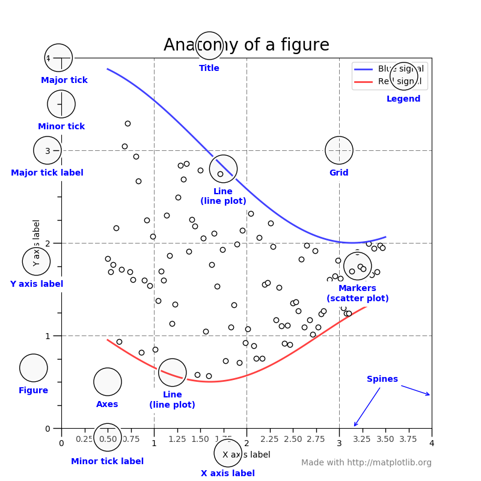

# Matplotlib 圖表函式庫
```cmd
pip install matplotlib
```
matplotlib為目前第一且唯一的圖表函式庫，提供了整套的圖表API，可以把數字繪製成圖表，也能作為繪圖API，官方網站上有超過百種以上的範例，唯一沒有地圖。

官方網站: matplotlib.org

_如果你老闆覺得畫出來很醜，可以改用JavaScript做_

matplotlib畫圖的核心概念


圖片來源:[深入淺出 Python 視覺化工具 matplotlib、Seaborn 的基礎與架構全指南與教學](https://medium.com/%E6%95%B8%E6%93%9A%E4%B8%8D%E6%AD%A2-not-only-data/%E6%B7%B1%E5%85%A5%E6%B7%BA%E5%87%BA-python-%E8%A6%96%E8%A6%BA%E5%8C%96%E5%A5%97%E4%BB%B6-matplotlib-seaborn-%E6%A0%B8%E5%BF%83%E6%8C%87%E5%8D%97%E8%88%87%E7%B9%AA%E8%A3%BD-44a47458912)

## pyplot 子函式庫

用來繪製2D圖表的子函式庫，常用。
```py
    import matplotlib.pyplot as plt
```

## 替換中文字形
Matplotlib在呈現中文字的時候會出現一堆框框，而且程式碼會出現一堆錯誤，雖然圖表還是會顯示，但總是覺得不太好看。

加上這三行code就能輕鬆解決！

```python
from matplotlib.font_manager import FontProperties 
plt.rcParams['font.sans-serif'] = ['SimSun'] # 替換sans-serif字型
plt.rcParams['axes.unicode_minus'] = False  #解決座標軸負數的負號顯示問題
```

## 圖表設定

旋轉座標標籤

```python
plt.xticks(rotation=30)
```