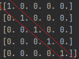

# 定義資料
_參照code：3.Numpy_zeros.py_<br/>

Numpy為了方便定義大量資料，提供了多個函式創建陣列。

_以下「陣列大小」都需要再以一個小括號包起來。_

---

## numpy.zeros(陣列大小)
創建的陣列內資料皆定義為0
```python
list_a=np.zeros((2,2)) #宣告2*2的二維陣列，並定義所有資料為0
print(list_a)   #[[0. 0.]
                # [0. 0.]]
```

---

## numpy.ones(陣列大小)
創建的陣列內資料皆定義為1
```python
list_b=np.ones((1,2))   #宣告1*2的二維陣列，並定義所有資料為1
print(list_b)   #[[1. 1.]]

list_b1=np.ones((2,2,3))#也可以宣告成三維陣列。
print(list_b1)  #[[[1. 1. 1.]
                #  [1. 1. 1.]]
                #
                # [[1. 1. 1.]
                #  [1. 1. 1.]]]
```

---

## numpy.full(陣列大小,資料值)
可以自由定義陣列裡的資料。
```python
list_c=np.full((2,2),7) #宣告2*2的二維陣列，並定義所有資料為7
print(list_c)   #[[7 7]
                # [7 7]]
```

---

## numpy.eye(x)
產生一個x*x的二維陣列。

以圖形說明，左上到右下的對角線，途中的值會定義為1，其餘為0。



```python 
#宣告以左上到右下對角線沿途資料為1其餘為0的二維陣列。
list_d=np.eye(3)    #參數代表需要幾層，此處會形成3*3的陣列
print(list_d)   #[[1. 0. 0.]
                # [0. 1. 0.]
                # [0. 0. 1.]]

list_d1=np.eye(5)    #形成5*5的陣列
print(list_d1)   #[[1. 0. 0. 0. 0.]
                # [0. 1. 0. 0. 0.]
                # [0. 0. 1. 0. 0.]
                # [0. 0. 0. 1. 0.]
                # [0. 0. 0. 0. 1.]]
```

---

## numpy.random.random(陣列大小)
定義陣列中的資料為0~1的亂數，測試會達到小數點後八位。
```python
list_e=np.random.random((2,2))  #定義2*2的陣列。
print(list_e)   #[[0.99603826 0.81595642]
                # [0.91926857 0.17690615]]
```