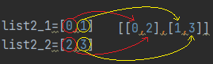
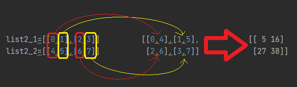

# 二維陣列的資料對應
_參照code：5.Numpy_Indexing2D.py_<br/>

關於二維陣列的應用可以將陣列想像成一張DataTable，有欄(col)、列(row)。
同理，三維陣列可想像成資料庫，裡面有一堆DataTable。
## 以一維陣列為索引
如果以一維陣列索引二維陣列時，會索引出二維陣列裡的陣列。
以下範例以資料1~20的4*5二維陣列作為被索引陣列。

```python
list1=np.array([[1,2,3,4,5],[6,7,8,9,10],[11,12,13,14,15],[16,17,18,19,20]])  #被索引陣列為數值1~20的4*5二維陣列。

print(list1)    #[[ 1  2  3  4  5]
                # [ 6  7  8  9 10]
                # [11 12 13 14 15]
                # [16 17 18 19 20]]
#索引出陣列。
list2=[0,2]
list3=list1[list2]    #索引第0、第2陣列
print(list3)    #[[ 1  2  3  4  5]
                # [11 12 13 14 15]]
#短寫法。
list3=list1[[0,2]]
print(list3)
```

這裡要注意，可能會不小心寫成索引第x陣列的x位置。
```python
list3=list1[0,2]    #索引第0陣列的第2位置的值，這樣裡面放的並不是陣列。
print(list3)    #3
```

---

## 以兩個陣列為索引

<br/>

### **兩個一維陣列**
當兩個一維陣列作為索引時，可以取得二維陣列最內層的資料，索引會得到一維陣列。

第一個陣列負責外層索引值，第二個陣列負責內層索引值，以圖片做講解。


```python
list2_1=[0,1]   #外層索引值
list2_2=[2,3]   #內層索引值

list3=list1[list2_1,list2_2]    #以兩個一維陣列作為參數。
print(list3)    #[3 9]

#短寫法
list3=list1[[0,1],[2,3]]    
print(list3)    #[3 9]
```

<br/>
<br/>

### **兩個二維陣列**

為方便理解，這裡將被索引陣列改為4*10的二維陣列。

索引陣列因為是相對關係，所以陣列內的架構必須一樣，索引出來的陣列架構也會一樣，以圖片詳解。



```python
list1=np.array([[1,2,3,4,5,6,7,8,9,10],
                [11,12,13,14,15,16,17,18,19,20],
                [21,22,23,24,25,26,27,28,29,30],
                [31,32,33,34,35,36,37,38,39,40]])

list2_1=[[0,1],[2,3]]
list2_2=[[4,5],[6,7]]

list3=list1[list2_1,list2_2]    #以兩個二維陣列作為參數。
print(list3)    #[[ 5 16]
                # [27 38]]
```