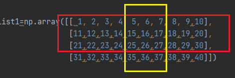

# 矩形索引 (我自己取的名字)
_參照code：6.Numpy_IndexingRect_<br/>
indexing可以從二維陣列中取得一個矩形內資料的方法。

list_b = list_a[w:x:,y:z]
+ w=外圈起點。
+ x=外圈終點(會在終點前停下)。
+ y=內圈起點。
+ z=內圈終點(會在終底前停下)。

以範例程式碼做解釋，[0:3:,4:7]，會選取0、1、2三個陣列(w:x)，會在選取的陣列中取得4、5、6的值(y:z)，形成一個二維陣列。

```python
list_a=np.array([[ 1, 2, 3, 4, 5, 6, 7, 8, 9,10],
                [11,12,13,14,15,16,17,18,19,20],
                [21,22,23,24,25,26,27,28,29,30],
                [31,32,33,34,35,36,37,38,39,40]])

list_b = list_a[0:3:,4:7]
```

