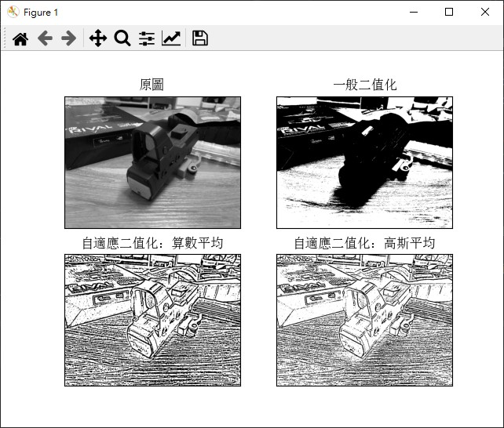

# Thresholding 二值化

_參照code：11.OpenCV_Thresholding.py_

為了明確的劃分照片中的物品，先將彩色照片轉為灰階，再轉成黑白，稱為二值化。

cv2.threshold(src, thresh, maxval, type, dst=None)

+ src : 處理圖片。
+ thresh : Threshold值，作為分界用。
+ maxval : 最大值。
+ type : 二值化的處理方式。

當點的值超過Threshold值，就會被設成最大值，舉例來說，想要全黑白的圖片，最大值就要設定成255，超過Threshold就會被設定成255的顏色，未超過就會變0。

二值化的處理方式也有多種：

+ THRESH_BINARY : 超過Threshold就設成最大值。
+ THRESH_BINARY_INV : 與上述相反。
+ THRESH_TRUNC : 目前沒用到，待補。
+ THRESH_TOZERO : 目前沒用到，待補。
+ THRESH_TOZERO_INV : 目前沒用到，待補。

使用時注意這個函式有兩個回傳值，第一個是Threshold值(float)，第二個才是處理後的圖像。
```python
#使用範例
ret, th1 = cv2.threshold(img, 127, 255, cv2.THRESH_BINARY)  # <127    0  else 255
```

# 自適應二值化

一般的二值化只會使用單一點的鰚去做分析，就會失去相鄰點的考慮，處理效果可能就不盡人意。

自適應二值化可以找到單一點與鄰近區域的關係，可以讓黑白相片有更好的效果。

cv2.adaptiveThreshold(src, maxValue, adaptiveMethod, thresholdType, blockSize, C, dst=None)

+ src : 處理圖片。
+ maxValue : 最大值。
+ adaptiveMethod : 自適應二值化算法。
+ thresholdType : 二值化的處理方式。
+ blockSize : 局部參考大小。
+ C : 微調參數。

自適應二值化算法有:

+ cv2.ADAPTIVE_THRESH_MEAN_C : 算術平均法，會取區域的平均值。
+ cv2.ADAPTIVE_THRESH_GAUSSIAN_C : 高斯加權均值法，會取高斯區域平均值，也就是多了權重。


可以先用中值模糊，以達到更好效果。

```python
#使用範例
img=cv2.medianBlur(img,5)    #5*5中值模糊

th2 = cv2.adaptiveThreshold(img, 255, cv2.ADAPTIVE_THRESH_MEAN_C, cv2.THRESH_BINARY, 11, 2) #算素平均
th3 = cv2.adaptiveThreshold(img, 255, cv2.ADAPTIVE_THRESH_GAUSSIAN_C, cv2.THRESH_BINARY, 11, 2)  #高斯平均
```

## 效果展示

