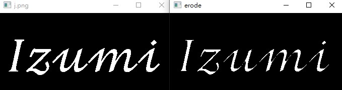
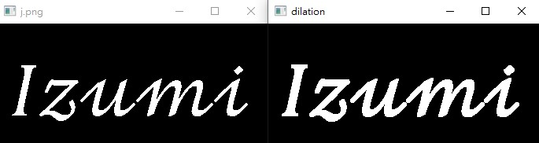

# Erosion 影像侵蝕、溶解

_參照code：12.OpenCV_Erode&Dilate.py_

溶解對於去除小白點很有幫助，也就是能夠去噪，也能細化影像。

影像侵蝕概念就是將影像中白色或高亮度區域做細化或縮減，讓圖像的白色區域更小。

簡單使用:

cv2.erode(src, kernel, iterations=None)

+ src : 處理圖像，需要進行二值化後的圖片。
+ kernel : 處理核心，可以當成筆刷的概念，會沿著物體邊緣處理。要給一個二維陣列。常見為3*3陣列。
+ iterations : 迭代次數，預設為1，可以想像成塗幾次筆刷。

```python
#使用範例
kernel = np.ones((3, 3), np.uint8)
erosion = cv2.erode(img, kernel, iterations=1)
cv2.imshow('erode', erosion)
```

效果



<br/>
<br/>
<br/>

# Dilation 影像擴充、膨脹

_參照code：12.OpenCV_Erode&Dilate.py_

主要用途有二，主要是配合影像侵蝕，先侵蝕影像使線條變窄，也可去除雜訊，再使用擴充將影像膨脹回來。

也能用來連接很分開且很靠近的物體。

與溶解相反，會將白色或高量區域進行擴張，讓物體胖一圈。

cv2.dilate(src, kernel, iterations=None)

+ src : 處理圖像，需要進行二值化後的圖片。
+ kernel : 處理核心，可以當成筆刷的概念，會沿著物體邊緣處理。要給一個二維陣列。常見為3*3陣列。
+ iterations : 迭代次數，預設為1，可以想像成塗幾次筆刷。

```python
kernel = np.ones((3, 3), np.uint8)
dilation = cv2.dilate(img, kernel, iterations=1)
cv2.imshow('dilation', dilation)
```

效果

