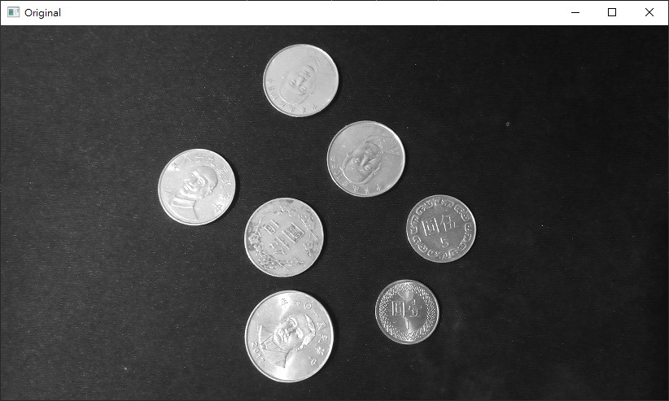
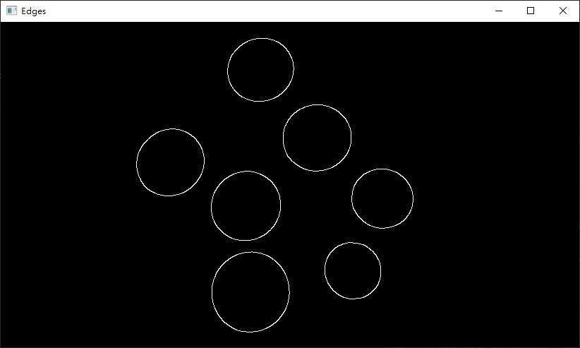

# Canny Edge Detection 邊緣檢測

_參照code：14.OpenCV_Canny.py_

cv2.Canny(image, threshold1, threshold2, edges=None, apertureSize=None, L2gradient=None)

+ image : 處理圖片。
+ threshold1 , threshold2 :區分強邊緣與弱邊緣，範圍是0~255，通常 threshold1/threshold2 會是 1/2 或 1/3 。 例如 : (70,210)
+ apertureSize : 用來計算梯度的Kernel Size ，也就是Sobel函式的Ksize。


使用時要先預處理。

1. 轉灰階照片
2. 去噪(模糊化)
3. Sobel梯度運算 (看情況)。

才使用邊緣檢測，效果才會好。

```python
img = cv2.imread('Coin.jpg', 0)  #讀取灰階照片。

img= cv2.GaussianBlur(img , (9,9),0)    #高斯模糊
edges = cv2.Canny(img, 100, 200)    #邊緣檢測
```

原圖 : 



處理後 :

