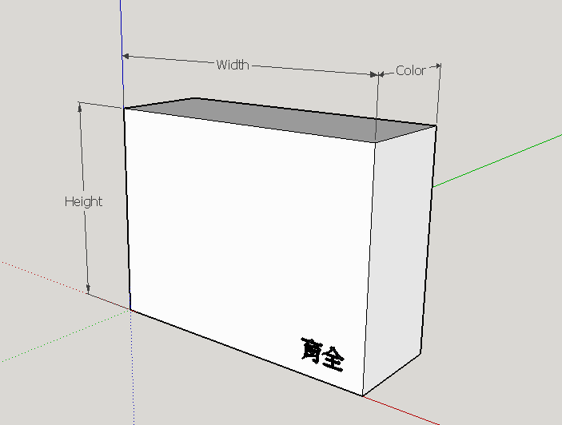

# 在圖片上做變化
OpenCV讀取圖片會形成一個三維的陣列。


這裡用立體圖表示，較容易理解。

所以圖片大小就會是這個立方體的體積。

例：200*100尺寸、RGB三原色的圖片，大小應該為200*100*3 byte 大約等於 60KB的檔案大小。

或是以表格方式理解


可以想成一個二維陣列，每個位置上都寫著那個點的顏色，以此方式容易理解如何更改圖片上的區塊。


## Code

_參照code：2.OpenCV_Draw.py_

讀取圖片
```python
img=cv2.imread('1.jpg')
```


讀出來的陣列是先高再寬才是深，也就是(Y,X,Z)。
```python
#顯示圖片的大小(高,寬,色深)
print(img.shape)    #(302, 403, 3)=302*403大小，3byte=24bit，24色深。
```

可以改變指定位置上的顏色，要注意這裡的RGB色號是反過來的，也就是BGR。
```python
img[0,0]=[0,0,255]  #左上角變紅點，很小要仔細看

#這段等同於這個寫法，第三個維度代表B、G、R的顏色號。
#img[0,0,0]=0       #色號0~255 =佔據1個Byte
#img[0,0,1]=0
#img[0,0,2]=255
```

區塊做法，這裡會用到資料對應(切割)的概念，可以先去把numpy學好。
```python
img[:10,-10:]=[0,255,255]     #右上角
img[-10:,-10:]=[0,255,0]    #右下角
```


按照程式碼，最後圖片會長這樣。