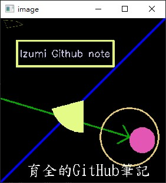
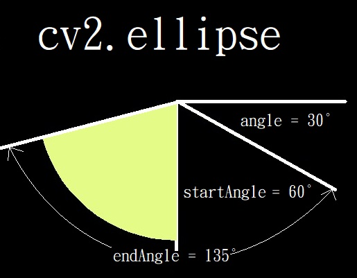

# 繪製圖形


_參照code：7.OpenCV_Paint.py_


以黑畫布做底演示效果
```python
img=np.zeros((512,512,3),np.uint8)
```

_備註:繪圖的函式返回值都是None，所以不用指定給變數。_




<br/>

---

<br/>

## 畫線

```python
cv2.line(img,pt1=(0,511),pt2=(511,0),color=(255,0,0),thickness=5)
```
+ img : 影像
+ pt1 : 起點，(x,y)。
+ pt2 : 終點，(x,y)。
+ color : 顏色 (B,G,R)。
+ thickness : 線條粗細。

<br/>

---

<br/>

## 折線、多邊形

cv2.polylines(img, pts, isClosed, color, thickness=None, lineType=None, shift=None)

+ pts : 頂點陣列。
+ isClosed : 布林。 是否封閉，簡單來說，最後一個點是否要連回第一個點。
+ lineType : 待補
+ shift : 待補

<br/>

先建立點座標陣列。

上課時老師的座標使用到四個維度且架構複雜(1,4,1,2)，但實際測試簡單的三個維度即可(1,4,2)。

老師版本(1,4,1,2)

```python
points=np.array([[10,5],[20,30],[70,20],[50,10]],np.int32)
print(points.shape)            # (4, 2)
points = points.reshape((-1,1,2))  #  4,1,2
print(points.shape)          # (4, 1, 2)    [[[10,5]] , [[20,30]] , [[70,20]] , [[50,10]]]
t1=np.array([points])
print(t1.shape)   # (1, 4, 1, 2)
```

個人版本(1,4,2)

```python
points=np.array([[[10,5],[20,30],[70,20],[50,10]]],np.int32)
```


畫線
```python
cv2.polylines(img,points,True,(0,122,122))
```

<br/>

---

<br/>

## 箭頭

畫箭頭的方式跟畫線基本一樣，只是用了不同函式。

```python
cv2.arrowedLine(img,pt1=(0,250),pt2=(400,370),color=(0,168,0),thickness=4)
```
<br/>

---

<br/>

## 方形

cv2.rectangle(img，左上，右下，color，thickness)

方形是最常使用的函式之一。

```python
cv2.rectangle(img,(50,50),(300,180),(118, 247, 228),5)
```

<br/>

---

<br/>

## 圓形

cv2.circle(img, center, radius, color, thickness=None, lineType=None, shift=None)

+ center : 圓心座標。
+ radius : 半徑。
+ thickness : 線條粗細，如果給予-1，則會填滿圓圈。


```python
#空心圓
cv2.circle(img,center=(400,370),radius=90,color=(118, 202, 228),thickness=3)    #radius=圓圈大小

#實心圓
cv2.circle(img,center=(440,380),radius=40,color=(180, 86, 228),thickness=-1)    #thickness粗細度改成負號，就會填滿圓圈
```

<br/>

---

<br/>

## 扇形、橢圓形

cv2.(img, center, axes, angle, startAngle, endAngle, color, thickness=None, lineType=None, shift=None)

+ center : 圓心座標。
+ axes : 軸長，也就是扇形半徑，需要給予兩個值(a,b)，故給予不同大小會使其變橢圓形。
+ angle : 扇形起始位置，為水平線以順時針開始計算。
+ startAngle : 從起始位置開始畫圓的起始位置。
+ endAngle : 終點位置。

所以會畫出 在angle位置開始，從startAngle順時針畫到endAngle的扇形。

更白話的講法是:
從 angle+startAngle 開始畫， 畫出endAngle-startAngle的角度。


圖解：




```python 
cv2.ellipse(img,center=(256,256),axes=(100,100),angle=30,startAngle=60,endAngle=135,color=(136, 251, 228),thickness=-1)
```
<br/>

---

<br/>

## 文字

```python
font=cv2.FONT_HERSHEY_SIMPLEX   #先建立字型
cv2.putText(img,text='Izumi Github note',org=(60,120),fontFace=font,fontScale=1,color=(219, 186, 195),thickness=2)
```

OpenCV字型列表
+ FONT_HERSHEY_SIMPLEX
+ FONT_HERSHEY_PLAIN
+ FONT_HERSHEY_DUPLEX
+ FONT_HERSHEY_COMPLEX 
+ FONT_HERSHEY_TRIPLEX
+ FONT_HERSHEY_COMPLEX_SMALL
+ FONT_HERSHEY_SCRIPT_SIMPLEX
+ FONT_HERSHEY_SCRIPT_COMPLEX
+ FONT_ITALIC

參考網址:[【OpenCV】文字绘制 putText](https://blog.csdn.net/baishuo8/article/details/84108774)

<br/>

---


## 中文字體

OpenCV提供的字型不多，可以使用PIL函式庫使用其他字型檔，如果要用中文字亦是如此。


```python
from PIL import ImageFont, ImageDraw, Image

# 載入字體
fontPath = "KAIU.TTF" #標楷體
font = ImageFont.truetype(fontPath, 48) #(字體檔案,字體大小)

#將底圖轉換成PIL影像
imgPil = Image.fromarray(img)

#在PIL圖片上繪製文字
draw = ImageDraw.Draw(imgPil)
draw.text((80,450),'育全的GitHub筆記', font = font, fill = (255,255,255))

#在轉回Numpy陣列
img = np.array(imgPil)
```

參考網址 : [G. T. WANG](https://blog.gtwang.org/programming/opencv-drawing-functions-tutorial/)

<br/>