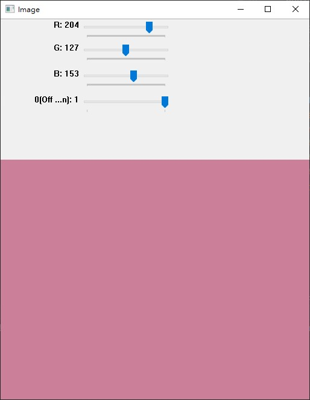

# Trackbar 滑動桿

_參照code：8.OpenCV_Trackbar.py_


主要函式:

## 建立滑動桿

cv2.createTrackbar(trackbarName , windowName , value , count , onChange)

+ trackbarName : 滑桿元件名稱。
+ windowName : 視窗名稱。
+ value : 預設值，網路上的文章都說這是最小值，但實測最小值會被固定成0，
這項參數只會改變建立時的預設值。
+ count : 最大值。
+ onChang : 滑桿變動時的事件，要注意這會傳一個值給函式，所以函式要能接一個值，不然會一直跳出提醒。可以建立空白事件，但不能不給。

```python
#使用範例

def nothing(x): #空白函式
    pass;

cv2.createTrackbar('R','Image',0,255,nothing)
```

<br/>

---

<br/>

## 取得數值

cv2.getTrackbarPos(trackbarname, winname)

+ trackbarName : 滑桿元件名稱。
+ windowName : 視窗名稱。


```python
# 使用範例
    r=cv2.getTrackbarPos('R','Image')
```

<br/>
<br/>
<br/>

# 應用-調整畫布顏色

這裡使用三個滑動桿調整畫布的顏色(RGB)，追加一個開啟功能的滑動桿。



建立滑動桿前，要先建立好視窗，否則會出現全白畫面。

方法有二

```python
window_Name='Image' #視窗名稱
#正確做法
cv2.namedWindow(window_Name)
#同等效果
cv2.imshow(window_Name,0)
```

建立滑動桿

```python
#建立三色TrackBar
cv2.createTrackbar('R',window_Name,0,255,nothing)   
cv2.createTrackbar('G',window_Name,0,255,nothing)
cv2.createTrackbar('B',window_Name,0,255,nothing)

#開關功能
switch='0(Off / 1(On)'
cv2.createTrackbar(switch,window_Name,0,1,nothing)
```

在更新視窗的時候一起改變底圖顏色，就可以免除設計變動事件的麻煩。

```python
while True:

    #取得滑桿位置
    r=cv2.getTrackbarPos('R',window_Name)
    g=cv2.getTrackbarPos('G',window_Name)
    b=cv2.getTrackbarPos('B',window_Name)
    s=cv2.getTrackbarPos(switch,window_Name)

    if s == 0:      #功能關閉
        img[:]=0    #畫布還原成黑色
    else:               #功能開啟
        img[:]=[b,g,r]  #設定顏色


    cv2.imshow(window_Name,img)
    cv2.waitKey(1)  #每1ms更新
```

<br/>

## 有兩點需要注意

+ ### 第一點：是img[:]而不是直接img。
  

    img=[b,g,r]  這是直接改變成一維陣列。

    img[:]=[b,g,r] 這是將三維陣列內值，全部替換成[b,g,r]。

    這算是新手容易做錯的部分，請注意。

+ ### 第二點 : OpenCV裡顏色陣列是BGR。
    初期使用很容易搞混順序，記得確認是否做反。

