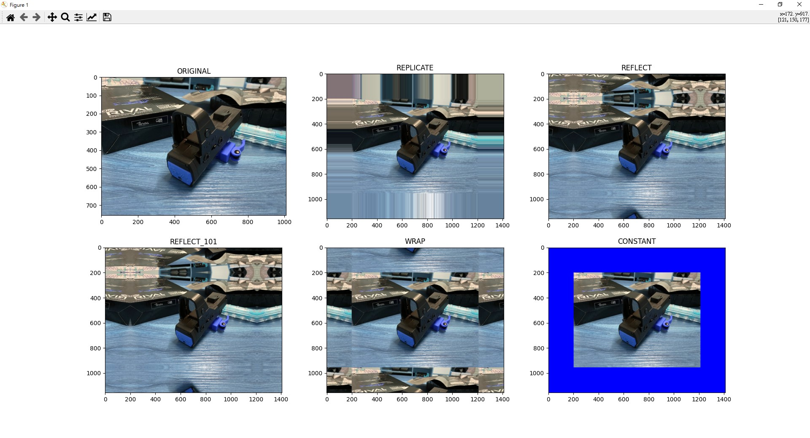

# 邊界處理

_參照code：9.OpenCV_MakeBorder.py_

在做卷積運算時會需要做邊界處理或是填上0的行為，這時候就能使用copyMakeBorder的函式。

cv2.copyMakeBorder(src, top, bottom, left, right, borderType, dst=None, value=None)

會回傳處理完的圖片，記得要用變數承接。

+ src : 處理圖片、來源圖片。
+ top : 上方處理範圍。
+ bottom : 下方處理範圍。
+ left : 左側處理範圍。
+ right : 右側處理範圍。
+ borderType : 邊界處理樣式。
+ dst : 待補。
+ value : 填補色彩。


可以使用的邊界處理有
+ BORDER_REPLICATE : 重複最後一個像素。
+ BORDER_REFLECT : 倒影重複。
+ BORDER_REFLECT_101 : 與上相似，細節待補。
+ BORDER_WRAP : 整張圖片重複。
+ BORDER_CONSTANT : 指定顏色補充。

```python
#處理範圍
top=200
bottom=200
left=200
right=200

BLUE = [0, 0, 255]  #藍色

#邊界處理
replicate = cv2.copyMakeBorder(img1, top=top, bottom=bottom, left=left, right=right, borderType=cv2.BORDER_REPLICATE)   #重複最後一個像素
reflect = cv2.copyMakeBorder(img1, top, bottom, left, right, cv2.BORDER_REFLECT)    #畫面倒影重複
reflect101 = cv2.copyMakeBorder(img1, top, bottom, left, right, cv2.BORDER_REFLECT_101) #與上相似
wrap = cv2.copyMakeBorder(img1, top, bottom, left, right,cv2.BORDER_WRAP)   #重複圖片
constant = cv2.copyMakeBorder(img1, top, bottom, left, right, cv2.BORDER_CONSTANT, value=BLUE)  #指定顏色
```

處理完的效果可以用matplotlib並排演示。

```python
plt.subplot(231), plt.imshow(img1), plt.title('ORIGINAL')
plt.subplot(232), plt.imshow(replicate), plt.title('REPLICATE')
plt.subplot(233), plt.imshow(reflect), plt.title('REFLECT')
plt.subplot(234), plt.imshow(reflect101), plt.title('REFLECT_101')
plt.subplot(235), plt.imshow(wrap), plt.title('WRAP')
plt.subplot(236), plt.imshow(constant), plt.title('CONSTANT')

plt.show()
```



如果圖像顏色怪異，是因為RGB沒有對應到正確位置。

可使用這段程式碼先將顏色對調回來。

```python
#色彩對調
img=cv2.cvtColor(img,cv2.COLOR_BGR2RGB)
```