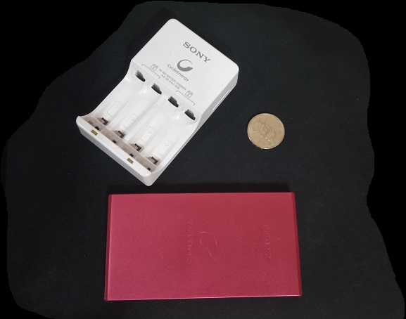
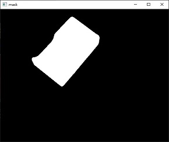
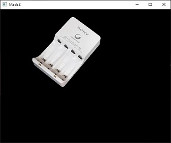

# 輪廓應用

_參照code：7.OpenCV_Contours2.py_

使用圖片：



一樣要先將圖片預處理，抓出輪廓。

```python
img=cv2.imread('ContoursObject.jpg')            #讀取圖片
img_Gray = cv2.cvtColor(img,cv2.COLOR_BGR2GRAY)  #轉灰階
img_New = cv2.medianBlur(img_Gray,5)             #中值模糊
ret, img_New = cv2.threshold(img_New, 45 , 255 ,cv2.THRESH_BINARY ) #二值化

#找輪廓
contours_List , hierarchy = cv2.findContours(img_New,cv2.RETR_EXTERNAL,cv2.CHAIN_APPROX_SIMPLE)
```

<br/>
<br/>
<br/>

# 取出物件(獨立顯示)

## 製作遮罩(Mask)

遮照部分只能使用單色圖片，所以建立遮罩底圖時，記得要以灰階圖片的陣列規格製作。
```python
#使用範例
mask = np.zeros(img_Gray.shape,np.uint8)    #與底圖相同規格的單色圖片。
cv2.drawContours(mask,[contour],-1,255,-1)  #畫出輪廓並以白色填滿。
```
遮罩效果



## 取出物件

把遮罩與原圖做AND運算，可以保留遮罩內的圖片，並將外區域以黑色呈現。

```python
img_Mask=cv2.bitwise_and(img, img, mask=mask)   #AND運算
cv2.imshow('mask_Name',img_Mask)  #顯示圖片
```

完成效果




<br/>
<br/>
<br/>

#  計算動能

## cv2.moments(array, binaryImage=None)

+ array : 物件輪廓。

```python
#使用範例
con_Moment=cv2.moments(contour) 

# 分行顯示，可以讓dict跳行不會擠在一起。
from pprint import pprint
pprint(con_Moment)
```

計算後得到的參數非常多，能依靠參數做其他應用，這部分有遇到會補充。

## 計算重心

繪製效果

```python
#計算重心
con_X=int(con_Moment['m10']/con_Moment['m00'])  #重心的X座標
con_Y=int(con_Moment['m01']/con_Moment['m00'])  #重心的Y座標

# 在重心的位置畫出黃色圓點
cv2.circle(img,(con_X,con_Y),10,(0,255,255),-1) 
```


<br/>
<br/>
<br/>


# 計算面積

在計算不規則形狀時，非常好用。

## cv2.contourArea(contour, oriented=None)

+ contour : 物件輪廓。

```python
# 使用範例
con_Area = cv2.contourArea(contour)
print("物體面積：",con_Area)
```

<br/>
<br/>
<br/>


# 計算周長

## cv2.arcLength(curve, closed)

+ curve : 物件輪廓。
+ closed : 布林值。是否封閉，一般為True。

```python
# 使用範例
con_Perimeter = cv2.arcLength(contour,True)
print("物體周長：",con_Perimeter)
```

<br/>
<br/>
<br/>

# 外接矩形

外接矩形在匡列物體上很常使用，可以搭配繪製矩形，必學。

## cv2.boundingRect(array)

+ array : 物件輪廓。

```python
# 使用範例
x,y,w,h = cv2.boundingRect(contour) #回傳左上角座標x,y 方形的寬高 w,h。
cv2.rectangle(img,(x,y),(x+w,y+h),(0,0,255),2)  #繪製矩形
```

<br/>
<br/>
<br/>

# 最小外接矩形

與外接矩形差異在會順著物體方向旋轉，形成最小的外接矩形。

## cv2.minAreaRect(points)

+ points : 物件輪廓。
  

此函式主要回傳值有三個，座標、寬高、角度，也可以用一個變數承接三個值。
同理，如果有需要可以拆分得更細。

```python
# 使用範例，一個變數接三個值。
box = cv2.minAreaRect(contour)  #返回Turple，((座標),(寬高),旋轉角度)

#繪製輪廓只能接受int的數值，所以需要先去除小數點。
box = np.int0(cv2.boxPoints(box))   #去小數點
cv2.drawContours(img , [box] , -1 , (0,255,0),2)    #繪製輪廓
```

## 三個值分開接。

```python
# 使用範例
a,b,c = cv2.minAreaRect(contour)  #三個值分開承接
print('a:',a)   #座標(x,y)    #a: (286.4943542480469, 348.7501525878906)
print('b:',b)   #寬高(w,h)    #b: (151.21095275878906, 280.33673095703125)
print('c:',c)   #旋轉角度      #c: 88.69805145263672
```

## 每個值個別承接。

```python
# 使用範例
(x,y),(w,h),c = cv2.minAreaRect(contour)  #個別承接
print('x:',x)   #座標X   #x: 286.4943542480469
print('y:',y)   #座標Y   #y: 348.7501525878906
print('w:',w)   #寬      #w: 151.21095275878906
print('h:',h)   #高      #h: 280.33673095703125
print('c:',c)   #旋轉角度 #c: 88.69805145263672
```


<br/>
<br/>
<br/>

# 外接正圓

## cv2.minEnclosingCircle(points)

+ points : 物件輪廓。

函式回傳兩個值，第一個「圓心座標」，第二個「半徑」。

```python
# 使用範例
center,radius=cv2.minEnclosingCircle(contour)   #回傳圓心、半徑

center=np.int0(center)  #去除小數點
radius=int(radius)      #去除小數點

cv2.circle(img,center,radius,(255,0,0),2)   #繪製圓形
```

<br/>
<br/>
<br/>

# 外接橢圓

## cv2.fitEllipse(points)

+ points : 物件輪廓。

函式回傳Turple ( ( 座標 ), ( 軸長 ), 角度 ) ，一樣可以分開承接。
```python
# 使用範例
ellipse= cv2.fitEllipse(contour)        #回傳值((座標),(軸長),角度)
cv2.ellipse(img,ellipse,(255,255,0),2)  #繪製橢圓
```


<br/>
<br/>
<br/>


# 擬合線

關於擬合線的用途以及說明，日後待補。

```python
# 使用範例    
rows, cols = img.shape[:2]
[vx, vy, x, y] = cv2.fitLine(contour, cv2.DIST_L2, 0, 0.01, 0.01)
lefty = int((-x * vy / vx) + y)
righty = int(((cols - x) * vy / vx) + y)
cv2.line(img, (cols - 1, righty), (0, lefty), (255, 0, 255), 2)
```


<br/>
<br/>
<br/>


# 形狀匹配

##  cv2.matchShapes(contour1, contour2, method, parameter)

+ contour1 : 輪廓1
+ contour2 : 輪廓2
+ method : 匹配方法。
+ parameter :預留引數，先不管。

返回值越接近零，表示形狀越相似。

```python
# 使用範例
cnt_a, cnt_b, cnt_c = contours_List[0], contours_List[1], contours_List[2]
print(cv2.matchShapes(cnt_a, cnt_a, 1, 0.0))  # 0.0
print(cv2.matchShapes(cnt_a, cnt_b, 1, 0.0))  # 0.4335000641805755
print(cv2.matchShapes(cnt_a, cnt_c, 1, 0.0))  # 0.10646901442163553
print(cv2.matchShapes(cnt_b, cnt_c, 1, 0.0))  # 0.32703104975893993
```