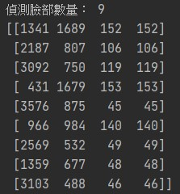

# Haar 分類器

1.HaarCascade

目前不常使用，簡單帶過。

### Haar分類器算法由四個主要部分組成：

1. Haar-like特徵 : 使用Haar-like特徵做檢測。 
2. 積分圖 : 使用積分圖(integral Image)對Haar-like特徵求值進行加速。
3. AdaBoost : 使用AdaBoost算法訓練區分人臉和非人臉的強分類器。
4. 級聯 : 使用篩選式級聯把強分類器級聯至一起，提高準確率。

資料參考來源 [Alex's Work](http://alex-phd.blogspot.com/2014/03/haarhaar-adaboost.html?view=classic)

<br/>
<br/>
<br/>

# 使用

先準備好訓練完成的Xml檔，網路上可以找到許多高手訓練完成的Xml，也可以自己訓練。

## 讀取Xml
使用OpenCV的函式庫讀取Xml檔案。

 cv2.CascadeClassifier(檔案路徑)

```python
# 使用範例
face_Cascade= cv2.CascadeClassifier('haarcascades/haarcascade_frontalface_alt.xml')
```


## 圖像辨識

CascadeClassifier.detectMultiScale(image, scaleFactor=None, minNeighbors=None, flags=None, minSize=None, maxSize=None)

+ image : 辨識圖片。
+ scaleFactor ： 縮放比，可以隨著想要偵測的物體大小調整，必須大於1 (>1)。
+ minNeighbors :
+ flags :
+ minSize :
+ maxSize :

```python
#使用範例
faces=face_Cascade.detectMultiScale(img_Gray,
    scaleFactor=1.1,    
    minNeighbors=3,
    minSize=(20,30),
    flags=cv2.CASCADE_SCALE_IMAGE)

# 也可以不使用參數

eye= eye_cascade.detectMultiScale(img_Gray)
```

辨識後會得到一個二維陣列，內層是以物件[x,y,w,h]組成。

可以用來繪製矩形匡列物體。

