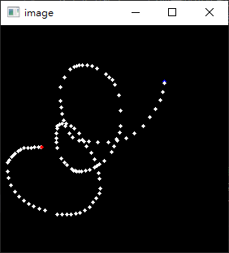

# 滑鼠事件
既然是視覺化函式庫，那一定做得出畫圖之類的功能。

OpenCV的函式庫有偵測滑鼠動作的功能
這個函式可以在視窗內偵測滑鼠動作並執行指定函式。
```python
cv2.setMouseCallback('視窗名稱',函式)
```

因為會送出這五個變數值，建立函式的時候記得接起來。

事件、滑鼠位置、標記、參數
```python
def draw(event,x,y,flags,param):    
```

event會收到滑鼠按鍵、移動之類的值，所以可以搭配if使用。
```python
 if event ==cv2.EVENT_LBUTTONDOWN:
```

<br/>
<br/>
<br/>

# 滑鼠繪圖

_參照code：5.OpenCV_MouseEvent.py_

簡單的概念說完，這裡開始嘗試做一個滑鼠繪圖的程式。

繪圖基本上要有一個畫布，可以利用numpy的函式建立一個全黑的陣列作為畫布。

```python
#畫一張280*280大小的圖，3byte=256色，資料型態是 8bit=1byte=0~255，用0填滿資料所以會是黑色。
img =np.full(shape=(280,280,3),fill_value=0,dtype=np.uint8)
```

得到一個畫布後，要設計滑鼠事件
```python
#做個布林，表示左鍵狀態。
drawing=False

def draw(event,x,y,flags,param):
    global img,drawing;

    if event ==cv2.EVENT_LBUTTONDOWN:   #按下滑鼠左鍵
        drawing=True    #表示左鍵被按下。
        #畫圓圈，座標以事件發生時滑鼠的位置。
        cv2.circle(img,(x,y),2,(255,0,0),-1)    #畫個藍色

    elif (event==cv2.EVENT_MOUSEMOVE) and (drawing == True):    #當左鍵被按下且滑鼠移動
        cv2.circle(img, (x, y), 2, (255, 255, 255), -1) #畫個白色

    elif event ==cv2.EVENT_LBUTTONUP:   #左鍵放開
        drawing=False
        cv2.circle(img,(x,y),2,(0,0,255),-1)    #畫個紅色

```

有了畫布、滑鼠事件，就可以偵測滑鼠動作了，個人覺得這東西很酷，明明不是無限迴圈，卻可以一直偵測?

```python
cv2.setMouseCallback('image',draw)
```

在畫布上作畫，一定要實時更新顯示，不然根本看不到自己做了甚麼，於是乎做了一個無限迴圈，就像在做影片處理那樣。

```python

#死迴圈，更新圖片
while True:
    cv2.imshow('image',img)
    key=cv2.waitKey(1)

    if key==ord('c'):   #還原成乾淨的畫布
        img=np.full(shape=(280,280,3),fill_value=0,dtype=np.uint8)
    elif key==27:   #ESC
        break;
```

程式效果

