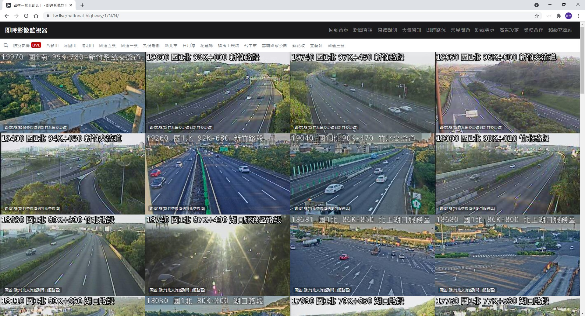
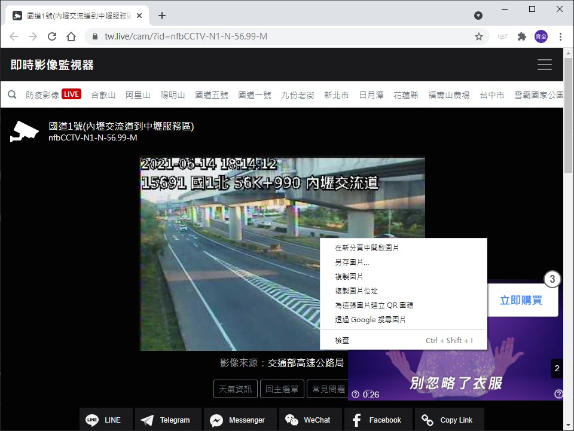
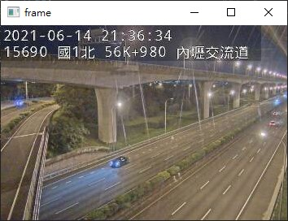

# 網路即時畫面

_參照code：OpenCV_IPcam.py_

VideoCapture不只可以讀影片、鏡頭，也可以讀取網頁上的圖片。

網路上可以看到很多即時影像，這裡以[即時影像監視器](https://tw.live/)上的影像做範例。



選好想要取得的畫面後，在畫面上點選右鍵 -> 複製圖片位址。




用OpenCV讀取網址即可，

```python
cap = cv2.VideoCapture("https://cctvn.freeway.gov.tw/abs2mjpg/bmjpg?camera=15690")


while cap.isOpened():
    ret, frame = cap.read()                 #取得回應、畫面
    if ret==True:                           #若有取得畫面
        cv2.imshow('frame', frame)          #顯示畫面
        key = cv2.waitKey(int(1000/fps))    #設定更新時間
        if key == 27:  # ESC
          break
    else:
        print("Waiting for connection")
```

程式執行畫面。



