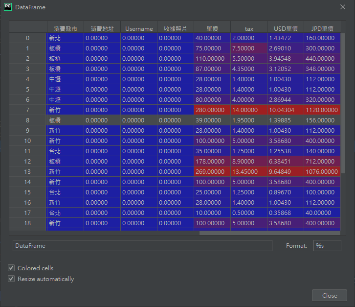

# Pandas

Pandas對於數據分析這一塊非常重要，Pandas提供高效能、簡易使用的DataFrame讓資料能快速操作及分析，Excel做得到的事情，Pandas也能夠做到！

Pandas可以輕鬆容易的抓取網路上的表格(只能讀HTML)、讀寫CSV及Excel格式的資料，DataFrame也可以轉換成欄(column)跟列(row)讓整理資料更有效率，還能夠借用matplot函式庫畫圖，又快又方便。

DataFrame是用來處理結構化(Table)的資料，有欄(Column)、列(Row)的二維資料集，長得就像DataTable，R語言也有使用DataFrame。

_官方網站：[Pandas.org](http://pandas.pydata.org/)_

## 範例會使用到的相關函式庫
> pip install pandas <br/>
> pip install xlrd <br/>
> pip install lxml <br/>
> pip install xlsxwriter <br/>
> pip install html5lib <br/>
> pip install BeautifulSoup4


# CODE

_參照code：1.Pandas.py_

引用函式庫
```python
import pandas as pd
```

## 讀取
### Excel

pandas..read_excel(io="Excel.xls",sheet_name='sheet',header=0)

+ io = 檔案路徑，要加上副檔名。也可以直接使用下載網址。
+ sheet_name = 資料表名稱，不給的話預設第一張，也可以給予數字。
+ header = 欄位位置，表格內資料是讀取欄位之後的資料，預設是0，就是最頂端第一行的。
    
    舉例：
    |row|col|
    |---|---|
    |row1|A|
    |row2|B|

    預設為0的時候，欄位=[row,col]，所以欄位['col']底下的資料有A、B。
    
    設置為1時，欄位等於[row1,A]，欄位[A]底下資料有B。


```python
#函式可簡化，(檔案路徑,sheet名稱,欄位位置)
dataFrame=pd.read_excel('交通事故代號對照表.xls','sheet')
```

### CSV
```python
dataFrame=pd.read_csv('交通事故代號對照表.csv')
```

### HTML
網頁上如果沒有表格，會跳出錯誤。
```python
dataFrame=pd.read_html('http://www.coolpc.com.tw/phpBB2/portal.php')
```

## 取用資料
Pandas的DataFrame在Debug的時候也非常方便，Debug模式下顯示資料會出現易於閱讀的表格，如果資料內容是數值，表格會有顏色表示數值高低。



(debug模式下看到的DataFrame)

### 取得欄位名稱
dataFrame.columns，可以取得該表的所有欄位名稱。
```python
print(dataFrame.columns)
```
第3位置上的欄位名稱。
```python
print(dataFrame.columns[3])
```

<br/>

### dataFrame.head(x)
顯示前x列的資料，不給x會預設是5
```python
#顯示前3列的資料。
dataFrame.head(3)
```
可以用List資料切割的方式。
```python
#顯示前5列的資料
print(dataFrame[:5])
```

<br/>

### 取欄位底下的資料(單一欄位)

取一個欄位，輸出會有兩排資料，首排為index。
```python
#輸出欄位名稱為'光線'的所有資料
print(dataFrame.光線)
print(dataFrame['光線'])
```

使用資料切割方式可以取得一個範圍內的資料。
```python
#在dataFrame的'事故位置'欄位找位置 2 的資料
print(dataFrame['事故位置'][2])
#找位置5
print(dataFrame['事故位置'][5])
#範圍資料切割，輸出2,3,4位置的資料。
print(dataFrame["事故位置"][2:5])
#value 會單純取值，並輸出成list，也就是不會出現index。
print(dataFrame['事故位置'].values)
```

<br/>

### 取欄位底下的資料(兩個欄位以上)

取兩個欄位，要用兩層中括號包裝。
```python
t2=dataFrame[['路面鋪裝','路面狀態']]
print(t2)
```

兩個以上欄位要取範圍比較麻煩，t2[4] 這樣是沒辦法的，這是錯誤的方式！
```python
#方法一
print(t2[4:5])  #必須指定範圍，即使只取一列。

#方法二
print(t2.loc[4])    #使用函式，但排版會有點奇怪。
```

### Index(row)資訊

顯示DataFrame中row的資訊，回傳值可以當做Range使用。
```python
a=dataFrame.index   
print(a)#會顯示(start,stop,step)

#長得像Range，可以當作List使用也是合乎情理的。
for x in a:
    print(x)
```

<br/>

### 儲存檔案

Pandas的寫入Excel功能是依靠xlsxwriter函式庫，所以使用此類功能必定要透過PIP裝xlsxwriter函式庫。

引用函式庫
```python
from pandas import ExcelWriter
```

建立檔案的時候，要用一個變數包裝後續才有辦法使用。
```python
#建立檔案(新檔案名稱,借用引擎)
writer = ExcelWriter('test.xlsx', engine='xlsxwriter')
#將DataFrame的資料寫入到檔案(檔案變數,資料表名稱)。
dataFrame.to_excel(writer, sheet_name='sheet2') #只會對記憶體進行操作。
#存檔
writer.save()#這裡才會真正寫入到檔案。
```

這裡加個小技巧，存檔的時候如果不想要index也被存進去，可以加上index=False，其他資料型態也適用。

```python
dataFrame.to_excel(writer, sheet_name='sheet2',index=False)
```

CSV儲存就相對簡單很多，我想是因為CSV本身就只是個斷點文字文件。
```python
dataFrame.to_csv('test.csv')
```