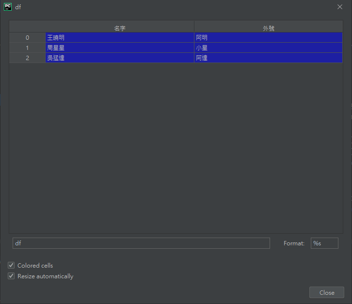
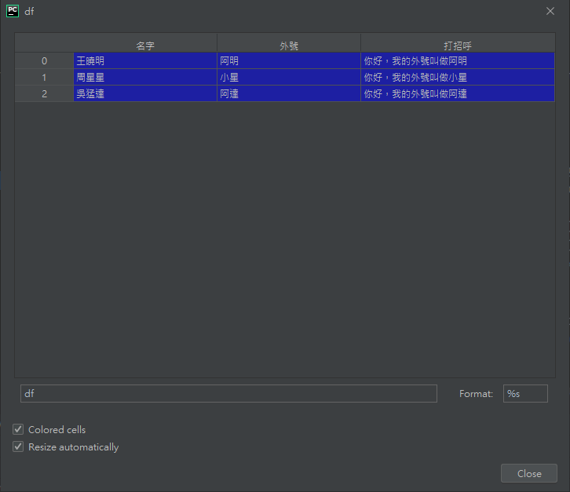

ㄌ# Pandas 增刪修改相關

# 刪除

## dropna() 刪除含有空值

這參數很好用！一定要記得有這東西。
```python
df.dropna(axis=0, how='any', inplace=True)
```

+ ### axis :
  
  &emsp; 0=行(預設)。

  &emsp; 1=列(欄位)
+ how : 
  
  &emsp; any=任一資料有空值就刪除(預設)。
  
  &emsp; all=全部資料為空值才刪除
+ inplace: 
  
  &emsp;  False=原本的df不動，會產生新的df(預設)。
  
  &emsp; True=直接更動原本的df，不需變數盛裝。


# 修改

## map() 替換

_參照code：Pandas_map.py_

這個寫法可以直接替換掉DataFrame裡面的值，不用一個一個慢慢replace，而且還可以用Dictionary多個替換值，非常好用，一定要記得有這東西。

```python
data = {'名字':['王曉明','周星星','吳猛達'],
       '外號':['小明','阿星',None]}
df = pd.DataFrame(data,columns=['名字','外號'])

replace_dict={'小明':'阿明',"阿星":"小星",None:'阿達'}   #替換答案用的Dictionary

#替換至新欄位
df['外號']=df['外號'].map(replace_dict)
```


map()的還有一個很厲害的用法，參數可以用函式。

這裡舉例，讓一個詞變成新句子。

```python
df['打招呼']=df['外號'].map('你好，我的外號叫做{}'.format)
```
