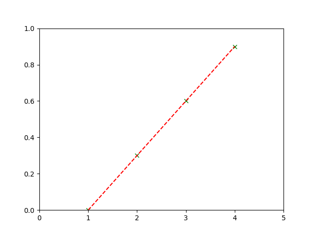

# Regression Analysis 迴歸分析

迴歸分析是一種統計學上解析數據的方法，目的在了解兩個或多個變數之間是否相關，並建立數學模型觀察特定變數做預測。

簡單來說，迴歸分析用來了解自變數與依變數的變化。

迴歸分析以自變數的數量可分為兩種：
1. 簡單迴歸分析(Simple) ： 以一個自變數去解釋一個依變數。
2. 複迴歸分析(Multiple) ：兩個或兩個以上的自變數去解釋一個依變數。

亦可依函數型態區分為
1. 線性(Linear) ：$Y=a+bX$
2. 非線性(Nonlinear) ： $Y=a+X^2$

## 繪圖練習

_參照code：1.Regression.py_

可以利用函式庫matplotlib進行繪圖，方便又快速。

假設手上擁有的大數據中，以油價對民眾交通習慣的影響為例子。

例如油價為現行價格的[ 1 , 2 , 3 , 4 ]倍時，大眾交通工具的乘坐人數會有[ 0 , 0.3 , 0.6 , 0.9 ]的增加比例。

在畫圖之前，要先搞清楚因果關係，因為是「油價上漲」而造成「大眾運輸乘坐人數增加」，我會把「因」放在X軸，「果」放在Y軸。

```python
x_List=[1,2,3,4]    #油價
y_List=[0,0.3,0.6,0.9]  #增加人數比例
```

分別將因果關係以點繪製在圖表上。
```python
plt.plot(x_List,y_List,'gx')
```

在將其所有點連起來，形成一直線。
```python
plt.plot(x_List,y_List,'r--')
```

