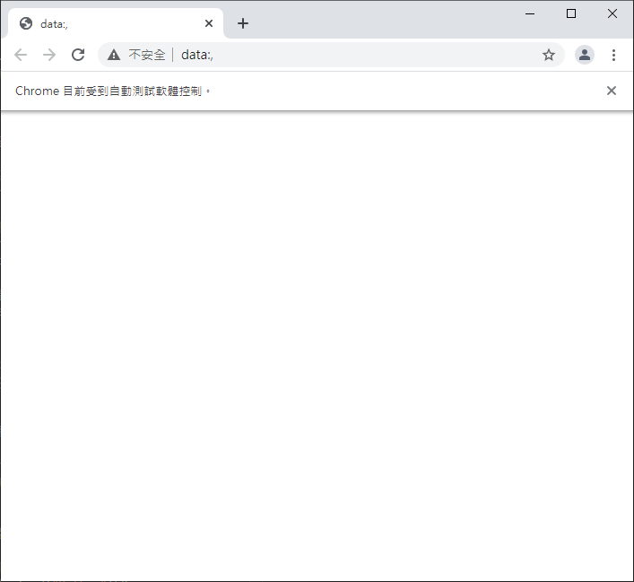

# Selenium 
Selenium 可以自動化瀏覽器操作，以達到自動化測試或是爬蟲的功能。


# 下載驅動

不同的瀏覽器需要不同的驅動，這裡使用Chrome作範例。

下載之前請先更新瀏覽器版本，並查看目前瀏覽器版本(說明->關於Google Chrome)。

確認後搜尋 [Chrome driver](https://chromedriver.chromium.org/)，找到下載頁面，說明中只要將

"https://chromedriver.storage.googleapis.com/index.html?path="

此段連結最後加上瀏覽器版本即可。

例如：

https://chromedriver.storage.googleapis.com/index.html?path=90.0.4430.72

下載檔案解壓縮後為exe檔，請不用直接執行，沒有作用，將檔案與執行的py檔放在同一目錄下即可。


## PIP
> pip install selenium

<br/>
<br/>
<br/>


# 程式撰寫
_參照code：1.selenium.py_<br/>

引用
```python
from selenium import webdriver  #模擬器主體
from selenium.webdriver.common.keys import Keys #輸入文字用途
```
## 基本語法

要宣告模擬器主題，先取用一個瀏覽器的設定值。

_注意!!這兩個方法的Chrome都是以大寫開頭，小寫是其他東西。_
```python
#取用chrome的設定值
option = webdriver.ChromeOptions()

#宣告模擬器主體，這裡會直接開啟模擬器
driver = webdriver.Chrome('chromedriver.exe',chrome_options=option)
```
模擬器開啟後會是空白的頁面，接下來的動作只要以自己在操作的方式去構想，會比較容易理解。


(模擬器畫面上方會有受到軟體控制的提示)

<br/>

轉向指定的網頁。
```python
driver.get('http://www.python.org')
```

<br/>

導向網頁後可以用條件式判別Title做一次驗證。
```python
assert "Python" in driver.title #檢查網站Title是否含有"Python"
```

<br/>

assert 用於確認條件，效果與if相似。
```python
#與這行效果相同
if driver.title.find("Python")>0:
```

<br/>

查找第一個name=q的元素，以變數為載體後續可以做其他應用。在其他文件中有較詳細的語法及講解。

```python
elem = driver.find_element_by_name("q")
```


執行結果會搜尋到這個Search Textbox。

<br/>

接下來就可以針對這個元素進行操作。

```python
#清空textbox
elem.clear()

#輸入"pycon"
elem.send_keys("pycon")

#按下Enter
elem.send_keys(Keys.RETURN)
```


這裡再做個Check，確保有回傳資料。
```python
assert "No results found." not in driver.page_source
```

<br/>

顯示回傳資料。
```python
print(driver.page_source)
```
<br/>

頁面控制
```python
#上一頁。
driver.back()

#下一頁。
driver.forward()
```
<br/>

用完可以關掉。
```python
driver.close()
```


## 參考資料
https://selenium-python-zh.readthedocs.io/en/latest/getting-started.html
