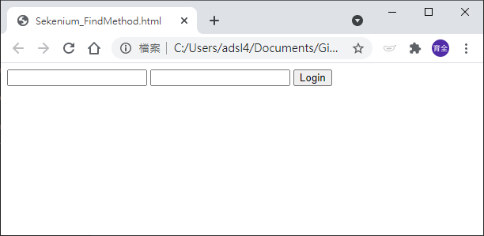

# 查找元素的函式

查找網頁元素的方法有很多，選一個最適合、最不容易出錯的方法很重要。
+ 定位單一元素
  + find_element_by_id
  + find_element_by_name
  + find_element_by_xpath
  + find_element_by_link_text
  + find_element_by_partial_link_text
  + find_element_by_tag_name
  + find_element_by_class_name
  + find_element_by_css_selector
+ 查找多個元素，回傳List。(有多s)
  + find_elements_by_name
  + find_elements_by_xpath
  + find_elements_by_link_text
  + find_elements_by_partial_link_text
  + find_elements_by_tag_name
  + find_elements_by_class_name
  + find_elements_by_css_selector
+ 分開講解。
  + find_element
  + find_elements 

在找不到元素的情況下，會拋出 NoSuchElementException 的錯誤訊息。
  
# 使用範例

_參照code：2.Selenium_FindMethon.py_

_參照HTML：2.Selenium_FindMethon.html_

範例html


```html
<html>
 <body>
  <form id="loginForm">
   <input name="username" type="text" />
   <input name="password" type="password" />
   <input name="continue" type="submit" value="Login" />
  </form>
 </body>
<html>
```
## 指向範例Html
url與local的用法不一樣，local端使用時可以不用透過ChromeDriver.exe，但路徑要使用絕對位置。
```python
driver = webdriver.Chrome()
driver.get('file:///'+os.path.abspath('./Selenium_FindMethod.html'))
```

<br/>

## 查找ID
會鎖定第一個符合條件的元素。
```python
login_Form=driver.find_element_by_id('loginForm')
```

<br/>

## Name
找到元素時，能夠對該元素進行動作。

可以對TextBox類的元素輸入文字。
```python
userName=driver.find_element_by_name('username')
userName.send_keys('admin')
```

也可以對元件進行點擊的動作。

範例中有兩個name=continue的元素，由於'Login'較前面，所以不會找到'Clear'按鈕。
```python
login_Btn=driver.find_element_by_name('continue')
login_Btn.click()
```

<br/>

# Xpath
Xpath不是首推的用法，應該歸類為最後的殺手鐧。

Xpath是根據標記語法(Markup Language)特性查找節點的方法，當目標元素沒有ID也沒有Name的時候，就是使用該方法的時機了。

由於Xpath是從根部位置(HTML標籤)做為出發點，所以當網頁有做任何調整，甚至只有些微調整都有可能使Xpath定位錯誤，正確用法應該以附近包含ID或Name的元素作為相對位置，準確率會相對的高上許多。

<br/>

## 查找Form的示範

基本用法為絕對位置查找。
```python
form_1=driver.find_element_by_xpath('/html/body/form[1]')
```

指定路徑中的第一個Form。
```python
form_2=driver.find_element_by_xpath('//form[1]')
```

尋找ID=loginForm的form元素。
```python
form_3=driver.find_element_by_xpath("//form[@id='loginForm']")
```

尋找第一個含有input元素且name=username的form元素。
```python
form_4=driver.find_element_by_xpath("//form[input/@name='username']")
```

<br/>


## 查找Username的示範

尋找id=loginForm的元素中第一個input子元素。
```python
userName_1=driver.find_element_by_xpath("//form[@id='loginForm']/input[1]")
```

尋找指定節點之中，第一個name='username'的input元素。
```python
userName_2=driver.find_element_by_xpath("//input[@name='username']")
print(userName_2)
```

<br/>

## 查找input的示範

尋找name='continue'、type='button'的input元素。
```python
clear_Btn1=driver.find_element_by_xpath("//input[@name='continue'][@type='button']")
```
尋找id='loginForm'的form元素，再往下尋找第四個input。
```python
clear_Btn2=driver.find_element_by_xpath("//form[@id='loginForm']/input[4]")
```

<br/>


## 小小心得總結


Xpath的搜尋字串中使用斜線(/)進入下一個節點，at(@)可以針對元素關鍵字做搜尋，當有多個相同元素時，可以使用類似於list的[x]指定第x個元素，但順序從1開始。


