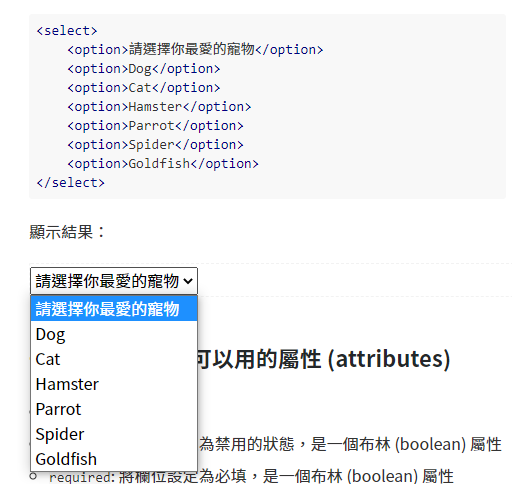
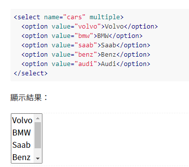

# 選單

_參照code：5.Selenium_Select.py_

_範例網址：[Fooish程式技術](https://www.fooish.com/html/select-option-optgroup-tag.html)_


(選單範例)

<br/>
<br/>
<br/>

# 徒法煉鋼

網頁上常常會遇到需要做點選的選單物件，先以下拉式選單作為範例。


搜尋選單標籤
```python
pets_ComboBox=driver.find_element_by_name('pets')
```

<br/>

可以在每段程式執行都做一點延遲，比較像人工處理。
```python
time.sleep(2)
```
<br/>

取得下拉式選單內的所有元素。

_注意!!因為是要選取多個元素所以要用elements。_
```python
pets_option=pets_ComboBox.find_elements_by_tag_name('option')
```
<br/>

跑一圈所有的選項，分別進行操作
```python
for row in pets_option:
    print('選項：',row.text)   #順便顯示出所有的值

    if(row.text=='Cat'):    #比較出自己想要的選項
        row.click() #點擊
```

以上做法看起來很不直覺，且有種徒法煉鋼的感覺，Selenium提供了更好用的函式'Select'。


<br/>
<br/>
<br/>

# Select 函式
引用函式
```python
from selenium.webdriver.support.ui import Select
```
<br/>

這裡以多選擇的選單作範例。


<br/>

宣告主體，尋找選單標籤後以Select函式包裝起來。
```python
cars_Select=Select(driver.find_element_by_name('cars'))
```
<br/>

檢查選單是否可以多選，回傳值為布林。
```python
print('多選：',cars_Select.is_multiple)
```
<br/>

Select提供了三種選取項目的方法。
```python
#方法一，根據排序。
cars_Select.select_by_index(0)  #選第一個

#方法二，根據顯示文字。
cars_Select.select_by_visible_text('BMW')   #選擇BMW

#方法三，根據元素內的Value。
cars_Select.select_by_value('saab')   #選擇value='Saab'
```
<br/>

顯示已被選取的選項
```python
for value in cars_Select.all_selected_options:
    print(value.text)
```
<br/>


Select提供了3+1種取消選取的方法，前三種與選取的概念相似，多了一個全部取消的方法，但我找不到全部選擇的方法(???)。
```python
#方法一，根據排序。
cars_Select.deselect_by_index(0)  #取消第一個
time.sleep(1)
#方法二，根據顯示文字。
cars_Select.deselect_by_visible_text('BMW') #取消BMW
time.sleep(1)
#方法三，根據元素內的Value。
cars_Select.deselect_by_value('saab')   #取消value='Saab'
time.sleep(1)
#取消所有選項
cars_Select.deselect_all()
time.sleep(1)
```