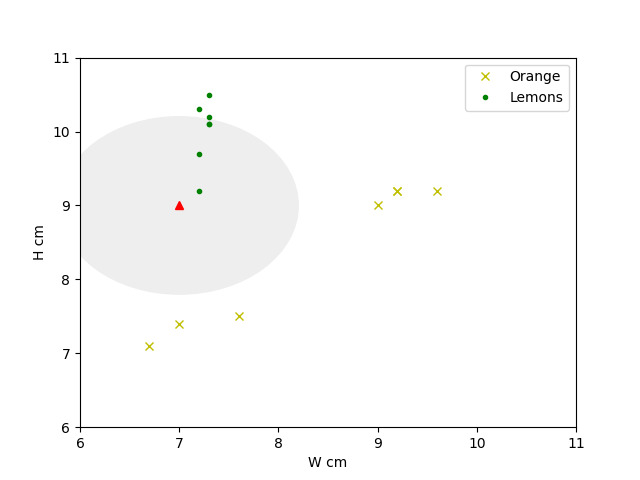

# Scikit-Learn

Scikit-learn是一個提供眾多演算法的科學函式庫，對於非統計學相關科系的軟體工程師相當友善，而且還內附了很多提供練習的資料集。

安裝PIP
> pip install sklearn

# 練習使用Sklearn的KNN判斷水果類別

_參照code：2.KNN_scikit-learn.py_


以上一個檔解說的圖形做KNN演算法。


這裡引入sklearn的KNN演算法模組

_註:Classifier是分類器的意思，念起來像Class Fire。_
```python
from sklearn.neighbors import KNeighborsClassifier
```

先準備好訓練要用的特徵值跟答案

```python
featrues=[[9, 9.0], [9.2, 9.2], [9.6, 9.2], [9.2, 9.2], [6.7, 7.1], [7, 7.4], [7.6, 7.5],   #這裡是橘子的特徵值
          [7.2, 10.3], [7.3, 10.5], [7.2, 9.2], [7.3, 10.2], [7.2, 9.7], [7.3, 10.1], [7.3, 10.1]]  #這裡是雷夢

label=[1,1,1,1,1,1,1,   #橘子
       2,2,2,2,2,2,2]   #雷夢
```


宣告主體的時候可以順便設定K值
```python
neigh=KNeighborsClassifier(n_neighbors=3)   #K=3
neigh.fit(featrues,label)   #訓練
```

演算法訓練完後，就可以開始做預測。

預測的特徵資料要給予一個陣列，這裡之所以看起來會是二維陣列。

是因為特徵值有兩個以上的值，於是用一個陣列包裝。

而餵給演算法處理的特徵陣列裡，每一個值都是單獨的個體。

拆開來看就是  個體=[特徵A,特徵B]，特徵陣列=[個體A]，

稍微組合一下就會發現，最後變成這樣 陣列=[[A,B]]。
```python
#預測
predict=neigh.predict([[7,9]])
print(predict)  #[2]
```

取分類時的概率，可以看分類可能性的百分比。
```python
#預測時的概率估計
proda=neigh.predict_proba([[7,9]])
print(proda)    #[[0. 1.]]
```
