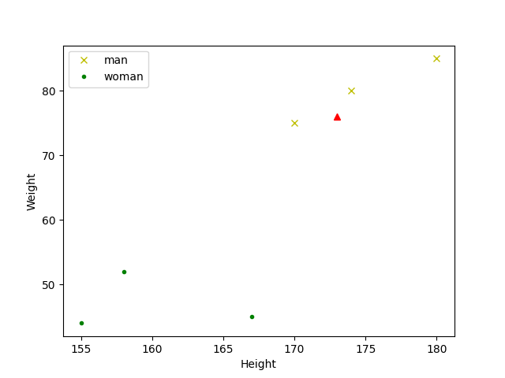

# DecisionTree SciKit-learn

_參照code：2.DecisionTree_sklearn.py_

再複習一下，使用sklearn的三個要點。
1. 引用
2. 宣告
3. 訓練

做完以上三項，就可以開始做預測以及其他的事了。

策略樹的引用非常短，好記！
```python
from sklearn import tree
import numpy as np  #順便引用一下numpy，但非必要。
```


準備好訓練資料
```python
#樣本
X=np.array([[180, 85],[174, 80],[170, 75],  #樣本-男
            [167, 45],[158, 52],[155, 44]]) #樣本-女
#答案
Y=np.array(['man','man','man','woman','woman','woman'])
```

宣告主體，並訓練他！
```python
#宣告
decision_Tree=tree.DecisionTreeClassifier()

#訓練
decision_Tree.fit(X,Y)
```

然後就可以預測了。
```python
#預測
predict=decision_Tree.predict([[173,76]])
print(predict)
```
<br/>
<br/>
<br/>


(圖表展示)