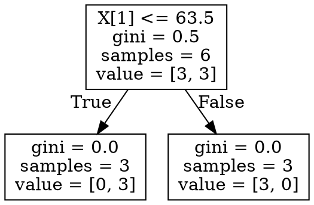
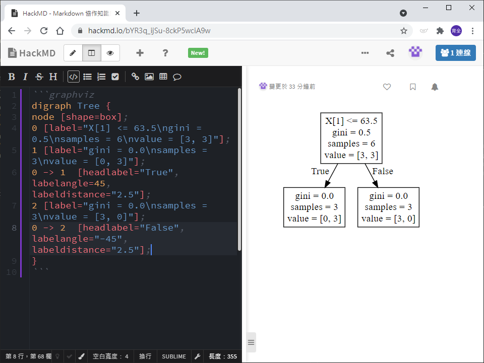

# 決策樹結果圖形化

_參照code：3.DecisionTree_graphical.py_

製作決策樹的重點就是要把樹狀圖呈現出來，這裡延續上一個範例作為示範。

## 轉成Dot檔案
```python
from sklearn.tree import export_graphviz

export_graphviz(decision_Tree,out_file='tree.dot')  #輸出DOT檔
```
DOT裡的文字會長這樣


可以透過hackmd.io變成圖片，一般Markdown不行。
