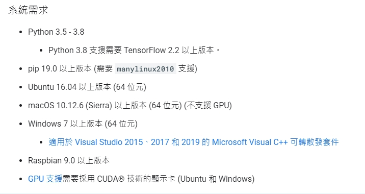
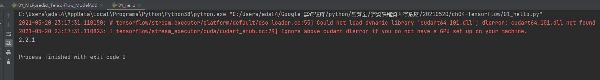

# Tensor Flow 
不要對人工智慧有太大幻想，真要說的話應該叫「凡走過必留下痕跡」，你訓練他甚麼他就回覆甚麼給你。

如果給一堆垃圾資料，他就還給你一堆垃圾，俗稱「Garbage In Garbage Out」。

Tensor Flow 是 Google Brain 在2015年底推出，目前市佔率是第一。

人工智慧的開源學習框架其實很多，比如說Theano、Tensorflow、Caffe、Keras、Torch。

Keras的函式庫其實比較簡單，Tensor Flow 相對上困難許多，後來Tensor Flow 把Keras買下，所以會在Tensor Flow 上使用到Keras的函式。

Tensor Flow 有很多版本，Java、JavaScript、C++、Python、Lite，Lite版本不會拿來做訓練。

<Br/>
<Br/>
<Br/>


## Tensor Flow的優勢

1. 開發自由度高
2. 網路上容易找到問題答案
3. 更新快速
4. 高度可視化工具

# 安裝



[tensorflow.org](https://www.tensorflow.org/)

上課用的 2.2.1 版本
> pip install tensorflow==2.2.1


安裝完畢後可以用一點程式碼測試是否安裝成功

```python
import tensorflow as tf
print(tf.__version__)
```
如果出現這種警告字串不用擔心，只要沒出錯跳出基本上安裝都是成功。
