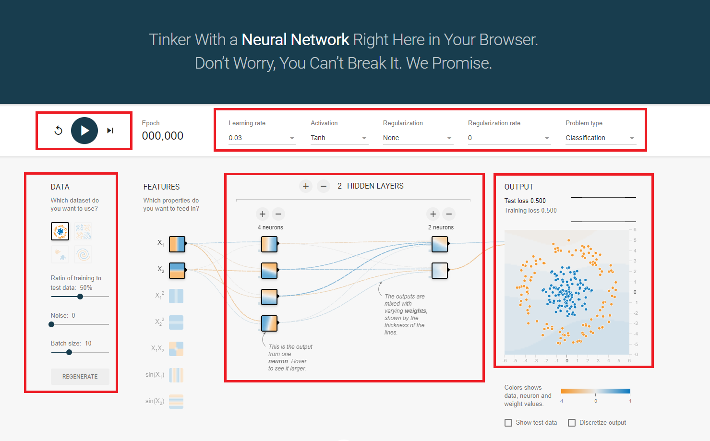

# Tensor Flow Playground

[Tensor Flow Playground](https://playground.tensorflow.org/)可以透過圖形更容易理解神經網路。

在圖片上被紅色框起來的部分都會做一些說明

左上側的按鈕簡單來看就是開始運算，與歸零重新的按鈕。

左側的Data可以調整資料設定，選擇資料類型、資料切割比例、單次訓練筆數。

上方的一堆的ComboBox，分別是
+ Learning rate 學習效率
  
    每次訓練的偏差值，調太高不好，調太低會搞很久才到定位。

+ Activation

    演算法算式

+ Regularization
  
    待補

+ Regularization rate

    待補

+ Problem type
  
    答案類型，回歸or分類。

中間為隱藏層與神經元的調整。

右側就是權重與結果圖形化。
