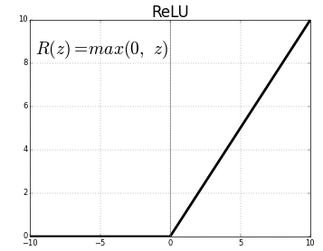
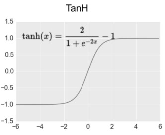

# Activation Function 激勵函式

如果不使用激勵函式，那類神經上只會有線性組合的輸出(如同矩陣相乘)，那輸入與輸出會脫離不了線性關係，類神經也會失去意義。

隱藏層通常都會用「Relu」激勵函式，其他部分看情況挑選，其他函式會有梯度消失的問題，沒有函式可以一招打天下，但在某個問題下一定有表現最好的函式。

 

---

## Relu 線性整流函式 (Rectified Linear Units）

## 大多時候都適合使用

Relu又稱修正線性單元，應該是最常使用的函式，因為他在大於0的時候並沒有梯度消失的問題，而且這個函式的運算速度很快。

所以只要沒有負數的特徵值，使用這個函式都很棒！

 

---

## Sigmoid  S函數

## 適合用於二分法

Sigmoid因其形狀像S而得其名，其形狀曲線至少有兩個焦點。

這個函式很適合作用於二分法，比如大於0.5=1、小於0.5=0，其他時候使用注意梯度消失的問題，特徵在正4到負4之間都還沒有問題。

 

---

## Tanh 雙曲函式

## 適合傳導負數

跟Sigmoid長得很像，但特徵值的有效範圍約正2到負2之間為佳，輸出也在-1與1之間，也就是可以傳導負值，如果數值很小、答案有負數又要做二分法可以嘗試。

 

---

## Softmax 

又稱「歸一化指數函式」，通常用在最後一層，適合多分類使用。